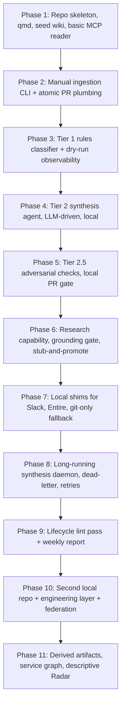
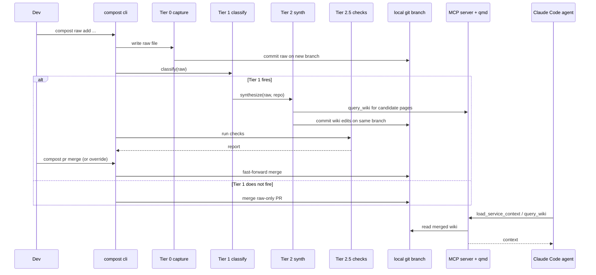
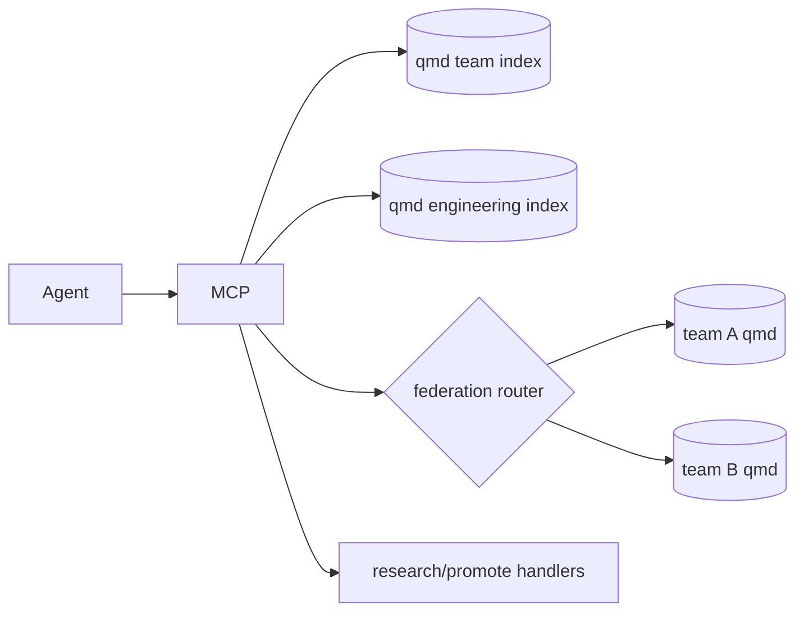

# Laptop Steel Thread, High Level Plan

## Starting Prompt

> read @implementation-handoff.md create a high level plan with phases. I'll using plan on each phase separately. Focus on how to "steel thread" and play with these ideas all on a local laptop first, since that will be the easiest / cheapest way to test it out iterate. You can still plan for things like a long running server or receiving webhooks, we'll just plan out dummy localhost shim services for those things.

---

## § Context and guiding constraints

This plan stages the compost system so every piece can be exercised end-to-end on a single laptop before any shared infrastructure exists. The goal is a *steel thread*: the thinnest possible vertical slice through ingestion, synthesis, checks, and MCP access that an engineer can drive by hand, watch happen, and tear apart.

The three specs in this repo ([team-context-spec.md](team-context-spec.md), [team-context-research-spec.md](team-context-research-spec.md), [implementation-handoff.md](implementation-handoff.md)) describe the destination. The plan here focuses on the *path* to it from zero, with shims standing in for anything that normally lives off-box.

Key design rules for the steel thread:

- **One repo on disk.** The "compost wiki repo" is a local folder. Real GitHub integration comes later; early phases use local git branches and either `gh pr create` against a personal remote, or a fully local "branch and merge" dance.
- **Shims, not stubs.** External dependencies (Slack, GitHub Actions runners, the Entire checkpoint stream, long-running webhook receivers) are replaced by small HTTP services or CLIs running on `localhost`. These shims mirror the real integration contracts so Phase N+1 can swap them for production services without touching the code that depends on them.
- **LLM calls are real.** The synthesis agent, adversarial checks, and research tools call the Claude API directly. This is the one non-local dependency we keep real from day one, since the whole system is about LLM-mediated synthesis.
- **Laptop ergonomics first.** Every phase ships a CLI entry point and log output a human can watch. No hidden background work until the basic flow is trusted.
- **Cheap and reversible.** Everything is on local disk; reset is `rm -rf`. Cost is API spend plus a bit of disk.

Non-goals for this high-level plan (each has its own deferral):

- Real GitHub Actions, real Slack workspace, real Entire deployments. Shims cover these until we want to promote.
- A hosted MCP server, auth, multi-tenant federation. v1 is one developer's laptop.
- A second real team. Phase 8 introduces a *second local repo* to exercise federation mechanics, not a second team of humans.

---

## § High-level plan

### Phases at a glance



Each phase is independently reviewable and ships a demo the user can drive from a CLI prompt.

### Module layout (cumulative)

The steel thread uses three separate local repos, matching the intended production topology: `compost-wiki/` (a net-new repo bootstrapped for testing), `org-context/`, and `engineering-context/`. The current repo (`/Users/eoin/workspace/compost`) is the *source/implementation* repo where the `tools/compost/` Python package lives; it is not one of the wiki repos. All wiki instances are fresh directories bootstrapped elsewhere on disk (e.g. `~/local-test/my-compost-wiki/`). Phase 1 creates the first test wiki repo; the other two are created as skeleton repos in Phase 10.

```
compost-wiki/          # wiki repo — one per team
├── TEAM.md
├── raw/
│   ├── checkpoints/YYYY/MM/DD/{sha}-{slug}.md
│   ├── slack/YYYY/MM/YYYY-MM-DD-{channel}-{slug}.md
│   ├── incidents/YYYY/INC-NNNN-{slug}.md
│   ├── decisions/NNNN-{slug}.md
│   ├── meetings/...
│   ├── support/...
│   ├── notes/...
│   ├── research/{date}-{slug}.md
│   └── commits/YYYY/MM/DD/{sha}-{slug}.md        # non-Entire fallback
├── wiki/
│   ├── services/ modules/ decisions/ runbooks/
│   ├── concepts/ customers/ people/ projects/
│   ├── glossary.md  index.md  log.md
│   └── meta/implementation-handoff.md            # moves here once bootstrapped
├── .qmd/
├── tools/                                        # <- all code lives here
│   └── compost/
│       ├── pyproject.toml
│       ├── cli.py                                # compost <verb>
│       ├── model/                                # frontmatter, schemas
│       ├── ingest/                               # Tier 0, 1 classifier, PR writer
│       ├── synth/                                # Tier 2 agent
│       ├── checks/                               # Tier 2.5 adversarial pipeline
│       ├── research/                             # grounding gate, promotion
│       ├── mcp/                                  # MCP server, tool handlers
│       ├── lint/                                 # weekly lint job
│       ├── derive/                               # Phase 11 artifacts
│       └── shims/
│           ├── slack_shim.py                     # localhost Slack receiver
│           ├── entire_shim.py                    # fake checkpoint emitter
│           ├── gh_webhook_shim.py                # fake GH PR events
│           └── synth_worker.py                   # background daemon
└── _plans/
```

Every phase below lists *only* the new or meaningfully changed modules.

---

### Phase 1: Repo skeleton, qmd, seed wiki, reader MCP

**Goal:** a working local "read only" version. An agent pointed at this MCP server can answer service questions from hand-authored content.

**Modules touched:** `TEAM.md`, `wiki/` (hand-authored seed pages), `.qmd/`, `tools/compost/{cli.py,model,mcp}/`.

**Deliverables:**
- `compost-wiki` repo bootstrapped with `TEAM.md` (already present, verify it matches the current spec). `ORG.md` and `ENGINEERING.md` live in their own separate repos (`org-context/`, `engineering-context/`) and are not part of this repo; Phase 10 creates those skeleton repos.
- 5+ hand-written wiki pages, correct frontmatter, covering one imaginary service surface.
- qmd configured against the wiki collection, indexing runs cleanly.
- MCP server with `load_service_context(service)` and `query_wiki(query, scope="team")` backed by qmd.
- `compost doctor` CLI verifies qmd, frontmatter, CODEOWNERS are sane.

**Steel thread:** point Claude Code at the MCP, ask "what do we know about the payments service?", get a grounded answer.

### Phase 2: Manual ingestion CLI + atomic PR plumbing

**Goal:** exercise the atomic PR invariant by hand before any LLM automation.

**Modules:** `tools/compost/ingest/` (raw writer, frontmatter filler), `cli.py` (`compost raw add`).

**Deliverables:**
- `compost raw add --source {slack|incident|decision|note|meeting} --title ... < content.md` writes to the right `raw/` subdirectory with correct naming.
- Branch creation + commit bundling helper: new raw file goes on a fresh `raw/{date}-{slug}` branch.
- PR creation: either `gh pr create` against a personal GitHub remote, or a fully local `compost pr open` that logs the would-be PR body to a markdown file under `_plans/pr-log/`. Both modes stay available; the local mode is the steel-thread default.
- `compost pr merge` for the local mode, fast-forward merges the branch if no wiki edits were needed.

**Steel thread:** a developer can capture a slack thread by hand, land it in `raw/slack/...`, review the "PR" locally, merge. No LLM yet.

### Phase 3: Tier 1 rules classifier + dry-run observability

**Goal:** automate the "should this trigger synthesis?" decision with rules, and set up the feedback loops called for in [implementation-handoff.md:49-55](implementation-handoff.md#L49-L55).

**Modules:** `tools/compost/ingest/classifier.py`, rules data file (`classifier_rules.yaml`), `compost ingest classify` subcommand, classification log under `.compost/classifications.jsonl`.

**Deliverables:**
- Rules engine matching the path, semantic, structural, volume triggers from [TEAM.md](TEAM.md) and [team-context-spec.md](team-context-spec.md) §4.1.
- Every classification logs `(raw_path, fired, matched_triggers, ts)` to jsonl.
- `compost classify --dry-run {raw_path}` explains the decision.
- `compost classify --replay --since 7d` re-runs the classifier across recent raws, useful for rule tuning.
- Hook into Phase 2's `compost raw add`: by default, classification runs and prints a fire/no-fire verdict. Synthesis still does not run yet.

**Steel thread:** land raw files, watch which ones the classifier flags, tune the rules by editing yaml.

### Phase 4: Tier 2 synthesis agent

**Goal:** close the loop from raw to wiki edits. This is the first real LLM work in the pipeline.

> **Deferred requirement (synthesis observability):** a dashboard for watching synthesis invocations, inspecting LLM session input/output, and tracking token cost per run. This is out of scope for the laptop steel thread but is a first-class requirement before this pipeline is used daily. Targeting Phase 8, where the long-running worker naturally needs run-level visibility. Minimum: a structured JSONL event log per synthesis run, plus a `compost synth log` view command that renders it.

**Modules:** `tools/compost/synth/` (synthesis agent, prompt templates, diff writer).

**Key function sketches:**

```python
@dataclass
class SynthesisResult:
    wiki_diffs: list[FileDiff]       # new or modified wiki pages
    pr_description: str
    cited_sources: list[str]
    declared_contradictions: list[ContradictionNote]

def synthesize(raw_path: Path, repo: Repo, model: str) -> SynthesisResult:
    """Reads raw, pulls relevant wiki via qmd, proposes edits in one LLM call
    per affected page. Uses the atomic PR branch from Phase 2 as the workspace."""
```

**Deliverables:**
- Synthesis agent invoked by `compost synth run --raw {path}` on the branch from Phase 2.
- Uses qmd to pull candidate wiki pages (the "plausibly affected" set).
- Writes proposed wiki diffs into the working tree, updates frontmatter (`sources`, `updated`, `confidence`, `supersedes`).
- PR description auto-generated with contradiction declarations.
- Triggered automatically by `compost raw add` when Tier 1 fires (with `--no-synth` escape hatch).
- Prompt and model config in `tools/compost/synth/prompts/` so they are diff-reviewable.

**Steel thread:** `compost raw add` on a decision-shaped note now produces both a raw file and proposed wiki edits in the same branch, ready for human review.

### Phase 5: Tier 2.5 adversarial checks

**Goal:** the six checks from [team-context-spec.md](team-context-spec.md) §4.1 run as a local pre-merge gate.

**Modules:** `tools/compost/checks/` (one file per check + a runner).

```python
class CheckResult(TypedDict):
    name: Literal["citation_faithfulness", "contradiction_scan",
                  "recent_raw_scan", "scope", "provenance", "human_edit_guard"]
    status: Literal["pass", "fail", "skipped"]
    findings: list[Finding]
    cost: Cost   # tokens + wall time

def run_checks(branch: str, repo: Repo) -> list[CheckResult]:
    """Cheap first, short-circuit on cheap failures, expensive checks last."""
```

**Deliverables:**
- `compost checks run` against the current branch, ordered: provenance, scope, contradiction scan, recent raw scan, human-edit guard, citation faithfulness.
- PR-comment-shaped markdown output (`_plans/pr-log/{branch}/checks.md`), rendered in the CLI and also written to disk so the Phase 7 shim can post it.
- Short-circuit policy: cheap failures skip expensive checks, but the report always shows what ran and what was skipped and why.
- `compost pr merge` is blocked when any check fails unless `--override --reason "..."` is provided (logged to `log.md`).

**Steel thread:** full local loop from `compost raw add` through Tier 1, Tier 2, Tier 2.5, human review, merge. This is the first "can I actually use this daily?" moment.

### Phase 6: Research capability, grounding gate, stub-and-promote

**Goal:** add the research extension from [team-context-research-spec.md](team-context-research-spec.md) without breaking any of the above.

**Modules:** `tools/compost/research/`, new MCP tools.

**Deliverables:**
- `raw/research/` directory created with per-schema templates.
- `compost research ask "{question}"` invokes an agent with web fetch tools, writes `raw/research/{date}-{slug}.md` with `promotion_status`, `expires_at`, `internal_sources`, `external_sources` frontmatter.
- Tier 1 classifier extension: ungrounded research is quarantined in raw, does not fire Tier 2.
- `compost research promote {id} [--into {wiki_page}]` implements the stub-and-promote UX: prompts the user to either cite an existing page or create a stub, then re-runs Tier 1.
- MCP tools `research_question`, `promote_research`.

**Steel thread:** ask a research question locally, watch it land quarantined, promote it explicitly, see it flow into a wiki edit through the Phase 4/5 pipeline.

### Phase 7: Local shims for async ingestion sources

**Goal:** prove push/pull ingestion without touching real external services.

**Modules:** `tools/compost/shims/`.

**Shims to build:**

1. **`slack_shim.py`** — a FastAPI app on `localhost:8421` mimicking the Slack events API. Accepts fake `reaction_added` payloads via a `compost slack fake-react --channel eng --ts ... --emoji wiki` command. On receipt, it writes to `raw/slack/...` using the Phase 2 ingestion path.
2. **`entire_shim.py`** — watches a configured local git repo (any repo on disk), materializes new commits matching a configured branch prefix as `raw/checkpoints/...`. A `compost entire seed` command can also hand-craft a checkpoint for testing.
3. **`gh_webhook_shim.py`** — a tiny HTTP server that receives "simulated GitHub webhook" payloads (PR opened, PR labeled) and triggers the local synth/check daemon. Lets us exercise "what happens when a PR is opened" without a real GitHub account.
4. **Git-only fallback connector** — a `compost entire fallback` mode that ingests `git log` + PR descriptions when there is no Entire branch, materialized under `raw/commits/` per [implementation-handoff.md:96](implementation-handoff.md#L96).

**Deliverables:**
- Each shim exposes the *same contract* the real service would, documented in `tools/compost/shims/README.md` (plain text note in module docstrings, not a separate doc file).
- `compost shims up` brings them all up as local processes supervised by a small Python supervisor.
- End-to-end demo: fake a slack reaction, watch the raw land, Tier 1 fire, Tier 2 synthesize, checks run, PR assembled locally.

### Phase 8: Long-running synthesis daemon, retries, dead-letter

**Goal:** move synthesis from "run on demand from the CLI" to "runs asynchronously against a queue", still entirely local. This is the laptop-shaped version of the GitHub Actions workflow in [implementation-handoff.md:61](implementation-handoff.md#L61).

**Modules:** `tools/compost/shims/synth_worker.py`, an on-disk work queue (`.compost/queue/{inbox,processing,dead}/`).

**Deliverables:**
- Ingestion enqueues a synthesis job by writing a json file to `queue/inbox/`.
- `compost worker up` runs a long-lived loop: moves jobs to `processing/`, runs Phase 4 + 5, moves to `done/` or `dead/` on permanent failure.
- Exponential backoff with a visible retry counter in the job file.
- Dead-letter creates a markdown "issue" in `_plans/dead-letter/{id}.md` rather than a real GitHub issue.
- Swap-in path: the worker's "queue source" and "failure sink" are pluggable, so Phase 10+ can replace them with real GitHub Actions and GitHub Issues without touching the synth/check code.

**Steel thread:** close the laptop, reopen, worker resumes work; no jobs lost.

### Phase 9: Lifecycle lint pass and weekly report

**Goal:** ship the lint responsibilities from [team-context-spec.md](team-context-spec.md) §4.8 and [team-context-research-spec.md](team-context-research-spec.md) §6 as a runnable job.

**Modules:** `tools/compost/lint/`.

**Deliverables:**
- Linters: stale citations, superseded research, expired research (`expires_at` past), low-confidence research feeding high-confidence wiki, orphaned raw, pages missing owners.
- `compost lint run` produces a markdown report. With `--emit-pr`, bundles findings into a single local PR (one branch, one commit touching `log.md` with the summary).
- "Weekly" is a cron line on the developer's laptop plus a `launchd` plist example in the module docstring; no external scheduler.
- Ties into the Phase 3 false-negative sampler (the "what-if" job) as a second linter.

### Phase 10: Second local repo + engineering layer + federation

**Goal:** prove federation mechanics with two local repos standing in for two teams plus an engineering repo.

**Modules:** `tools/compost/mcp/` (federation router), `engineering-context/` local repo, a second team repo.

**Deliverables:**
- Config file (`~/.compost/federation.yaml`) listing repo paths + qmd collections.
- `query_across_org(query)` and `find_service_owner(service)` MCP tools, fan out to configured repos in parallel, merge results, deduplicate by entity.
- Engineering repo ships a hand-authored `services.md` master index to test the "service index drives fan-out" flow.
- Federation happens at query time only, per [team-context-spec.md](team-context-spec.md) §7.2, never at ingestion time.

**Steel thread:** from Claude Code, ask an engineering-wide question, see it route across both local team repos.

### Phase 11: Derived artifacts

**Goal:** generate the descriptive Radar, service dependency graph, and master service index from team wiki frontmatter.

**Modules:** `tools/compost/derive/`.

**Deliverables:**
- `compost derive radar` scans `technology:` frontmatter across team wikis, emits a descriptive Radar page into the engineering repo.
- `compost derive graph` scans `depends_on` / `depended_on_by`, emits a Mermaid or DOT graph.
- `compost derive services` rebuilds the engineering master service index.
- Each derive job opens a PR in the engineering repo (local mode in Phase 2 style). Runs nightly via the same launchd plist as the lint job, or on demand.

---

## § Data flow, atomic PR pipeline



## § MCP tool surface after Phase 10



---

## § Core domain objects

```python
# tools/compost/model/frontmatter.py

FrontmatterType = Literal[
    "service", "module", "decision", "runbook", "concept",
    "customer", "person", "project", "research",
]

class Frontmatter(TypedDict, total=False):
    type: FrontmatterType
    name: str
    owners: list[str]                   # wiki owners, min 1
    status: Literal["active", "deprecated", "archived"]
    updated: date
    confidence: Literal["high", "medium", "low"]
    sources: list[str]                  # required, non-empty
    related: list[str]
    supersedes: list[str]
    superseded_by: str | None
    # research-only
    promotion_status: Literal["not_promoted", "promoted"]
    expires_at: date | None
    internal_sources: list[str]
    external_sources: list[str]
    # derivation fields
    depends_on: list[str]
    depended_on_by: list[str]
    technology: list[str]
    org_registered: bool
    org_scope: bool
    engineering_scope: bool


# tools/compost/ingest/classifier.py
@dataclass(frozen=True)
class ClassifyDecision:
    fired: bool
    triggers: list[str]                 # e.g. ["path:ADR/*", "semantic:decision"]
    rationale: str

def classify(raw_path: Path, raw: RawFile) -> ClassifyDecision: ...


# tools/compost/mcp/tools.py
def load_service_context(service: str) -> ServiceContext: ...
def query_wiki(query: str, scope: Literal["team","org","eng"]="team",
               limit: int = 10) -> list[WikiHit]: ...
def find_prior_art(topic: str, scope: str = "team") -> list[WikiHit]: ...
def find_service_owner(service: str) -> OwnerInfo: ...
def query_across_org(query: str) -> list[WikiHit]: ...
def research_question(question: str, scope: str) -> ResearchRecord: ...
def promote_research(record_id: str,
                     into_page: str | None = None) -> PromotionResult: ...


# tools/compost/shims/*.py
class SlackShimConfig(BaseModel):
    port: int = 8421
    channels_pull: list[str] = []
    channels_push: list[str] = []

class EntireShimConfig(BaseModel):
    watch_repos: list[Path]
    checkpoint_branch: str = "entire/checkpoints/v1"
    poll_interval_s: int = 30
```

---

## § Documentation updates

In-repo docs that will need edits as phases land:

- [TEAM.md](TEAM.md): after Phase 3, append the realized classifier rule set (a working decision baseline). After Phase 5, add pointers to each check's implementation.
- [ENGINEERING.md](ENGINEERING.md): updates only after Phase 10, once a second repo exists and the service index is populated.
- [ORG.md](ORG.md): untouched until a real org layer lands, likely well beyond this plan.
- [implementation-handoff.md](implementation-handoff.md): this document is a scoping note, not a living doc. Once Phase 1 lands, it moves to `wiki/meta/implementation-handoff.md` per the footer on that file.
- `README.md`: does not exist yet. Phase 1 should add a short one describing the layout and the `compost` CLI.

External docs not in this repo (not in scope for any phase here):
- Slack app manifest, GitHub Actions workflow YAML, Entire integration docs. Shims hold the contracts until Phase 12+.

---

## § Open questions the high-level plan deliberately defers

These are flagged for the per-phase plans rather than answered here:

- Model choice per component (synth vs. checks vs. classifier). Phase 4 and Phase 5 will decide.
- Exact qmd collection layout (one team collection, or split by entity type?). Phase 1 picks a starting shape.
- Whether the MCP server is one process or a thin router in front of per-repo indexers. Phase 10 revisits.
- Key caching and rate-limit handling on Claude API calls. Phase 4 plan will cover.
- Schema versioning for research records. Phase 6 plan will cover.

---

## § What this plan does NOT promise

Per [implementation-handoff.md](implementation-handoff.md) §6:

- No auto-merge in any phase here. All merges are human-gated locally.
- No org-layer content growth. Engineering and org wikis stay skeletal through Phase 11.
- No centralization to paper over federation latency. If Phase 10 feels slow, the Phase 10 plan will propose caching, not collapsing the federation model.
- No treating research as a Q&A log. `compost research ask` stays explicit and ceremony-ish by design.

---

*High-level plan ready for review. Next step: run `/plan-impl:plan` on Phase 1 when the phase list looks right.*

---

### Feedback Log

**Module layout — this repo is the implementation source, not a wiki instance**
> Original comment (verbatim): `^^ well this repo (that we're doing the planning in) is really the source to implement team, org, engineering wikis. for local laptop testing we should bootstrap a net-new repo to keep it all separated. ^^`
>
> Context: appeared after the module layout intro note that said "`team-context/` (this repo)".
>
> Incorporated: clarified that this repo (`/Users/eoin/workspace/compost`) is the implementation source for the `tools/compost/` package. All wiki instances are net-new directories bootstrapped elsewhere on disk for testing. Phase 1 creates the first test wiki repo; this repo is never used as a wiki instance.

---

**Phase 1 deliverables — repo topology**
> Original comment (verbatim): `^^ i think we originally said that team, org, and engineering would be separate wikis and therefore repos right? ^^`
>
> Context: the deliverable originally read "Repo bootstrapped with `TEAM.md`, `ORG.md`, `ENGINEERING.md` (already present, verify they match the current spec)."
>
> Incorporated: updated the module layout note and Phase 1 deliverables to make clear that `ORG.md` and `ENGINEERING.md` belong to separate `org-context/` and `engineering-context/` repos, not to this `compost/` repo. Those repos are created in Phase 10.

---

**Phase 4 — synthesis pipeline observability dashboard**
> Original comment (verbatim): `^^ I think this may be out of scope for laptop steel thread, but I know I'm going to want a dashboard to observe the pipeline of synthesis invocations, the input/output from the LLM session, details around cost, etc. ^^`
>
> Context: appeared directly under the Phase 4 heading.
>
> Incorporated: added a deferred-requirement callout in Phase 4 capturing the dashboard requirement (per-run structured JSONL log, `compost synth log` viewer, LLM input/output, cost tracking) and targeting Phase 8 as the landing zone.
