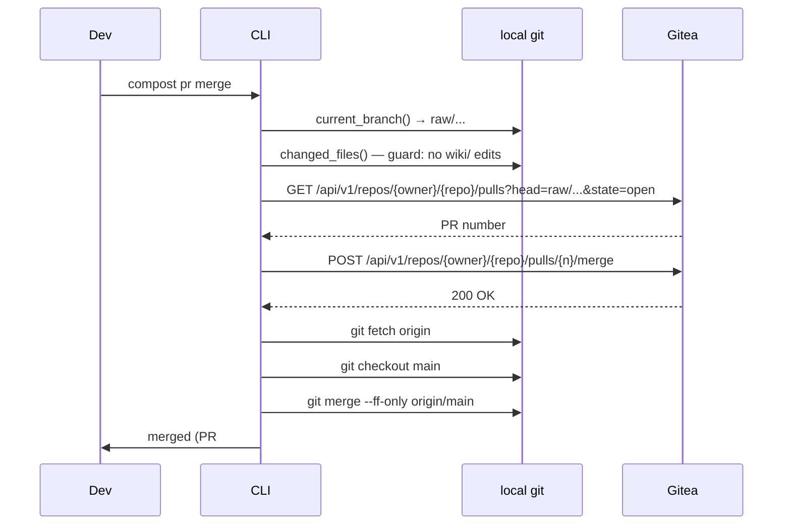

# Gitea PR Integration High-Level Plan

## Starting Prompt

> Instead of simulating "PRs" with pr_log lets use gitea. I have it running locally, but not configured yet.

**Revision note:** local `_pr-log` fallback removed entirely per follow-up. Gitea is the only PR backend.

---

## § Context

Currently `compost pr open` writes a markdown file to `_pr-log/` and `compost pr merge` fast-forward merges locally. This is a local simulation of a real PR flow.

Gitea 1.26.0 is running at `http://localhost:3000` with no repos configured yet. This plan replaces the local simulation with real Gitea PRs. The `_pr-log` directory and `PRLog` dataclass are deleted.

This is independent of Phase 3 (classifier). Both plans can land in either order.

---

## § What changes, end to end

**Before:**
```
compost raw add   → write file, commit on raw/* branch (local only)
compost pr open   → write _pr-log/{branch}.md
compost pr merge  → fast-forward merge locally
```

**After:**
```
compost raw add   → write file, commit, push to Gitea, open Gitea PR → print PR URL
compost pr open   → print URL of existing Gitea PR for current branch
compost pr merge  → validate guards, merge via Gitea API, sync local repo
```

---

## § Configuration

`gitea:` is a required section in `.compost.yml` (validated by `doctor`):

```yaml
name: my-team
qmd_index: my-team
gitea:
  url: "http://localhost:3000"
  owner: "myteam"       # Gitea user or org login
  repo: "my-team-wiki"  # Gitea repo name
```

Token via env var: `GITEA_TOKEN`. Never stored on disk. Commands that need Gitea exit with a clear error if `GITEA_TOKEN` is unset.

`load_repo_config()` in `repo.py` is unchanged. The CLI reads `config["gitea"]` and constructs a `GiteaClient` before calling `pr.py`.

---

## § New command: `compost gitea setup`

One-time bootstrap from an already-initialized wiki repo:

```
compost gitea setup
  [--url URL]         default: http://localhost:3000
  [--owner OWNER]     Gitea user or org (required)
  [--repo REPO]       Gitea repo name; defaults to .compost.yml `name`
  [--token TOKEN]     API token; falls back to GITEA_TOKEN env var
  [--remote REMOTE]   git remote name; default: origin
```

Steps executed in order:
1. Validate token via `GET /api/v1/user` — prints the authenticated username.
2. Create the Gitea repo if it does not exist (`POST /api/v1/user/repos` for a user owner, `POST /api/v1/orgs/{owner}/repos` for an org).
3. Add or update the `origin` remote to the Gitea clone URL.
4. Push `main` with `git push --set-upstream origin main`.
5. Write the `gitea:` block into `.compost.yml` and commit the change.
6. Run `doctor` and print results.

---

## § Flow diagrams

### `compost raw add`

```mermaid
sequenceDiagram
    participant Dev
    participant CLI
    participant local as local git
    participant Gitea

    Dev->>CLI: compost raw add --source decision --title "..."
    CLI->>local: write_raw() → RawFile
    CLI->>local: create_branch_and_commit()
    CLI->>local: push_branch(origin, raw/...)
    CLI->>Gitea: POST /api/v1/repos/{owner}/{repo}/pulls
    Gitea-->>CLI: PR number + URL
    CLI->>Dev: ✓ raw/decisions/2026-04-28-use-stripe.md
              branch: raw/2026-04-28-use-stripe
              PR #3: http://localhost:3000/myteam/my-team-wiki/pulls/3
```

### `compost pr merge`



---

## § Module layout

```
tools/compost/
├── gitea/
│   ├── __init__.py          new (empty)
│   └── client.py            new — sync httpx wrapper over Gitea REST API
├── ingest/
│   ├── pr.py                modified — Gitea-only, delete PRLog + _pr-log logic
│   └── git.py               modified — add push_branch()
└── cli.py                   modified — gitea group + setup command,
                                        raw_add push + PR creation,
                                        pr open prints URL,
                                        doctor Gitea checks
```

**Deleted:** `_pr-log/` directory in wiki repos (no longer written).

---

## § Core objects

### `gitea/client.py`

```python
from __future__ import annotations
from dataclasses import dataclass
import httpx


@dataclass(frozen=True)
class GiteaPR:
    number: int
    url: str
    state: str   # "open" | "closed" | "merged"


class GiteaError(Exception):
    pass


class GiteaClient:
    def __init__(self, url: str, owner: str, repo: str, token: str) -> None: ...

    def get_authenticated_user(self) -> str:
        """Return login of token holder. Raises GiteaError on auth failure."""

    def create_repo(self, name: str, private: bool = False) -> None:
        """Create repo under owner. No-op if already exists."""

    def open_pr(self, branch: str, base: str, title: str, body: str) -> GiteaPR:
        """Create a PR and return it."""

    def find_pr(self, branch: str) -> GiteaPR | None:
        """Return the open PR for branch, or None."""

    def merge_pr(self, pr_number: int) -> None:
        """Merge PR via API. Raises GiteaError on failure."""
```

All methods synchronous. `GiteaClient.__repr__` never includes the token.

### `ingest/pr.py` (revised signatures — no fallback)

```python
@dataclass(frozen=True)
class GiteaPR:   # re-exported from gitea.client for callers
    number: int
    url: str

def open_pr(repo: Path, branch: str, client: GiteaClient) -> GiteaPR:
    """Push-opened PR: look up by branch, return it."""

def merge_pr(repo: Path, client: GiteaClient) -> GiteaPR:
    """Validate guards, merge via API, sync local repo. Returns merged PR."""
```

`PRLog` and `_pr-log` writing are removed entirely.

### `git.py` addition

```python
def push_branch(repo: Path, remote: str, branch: str) -> None:
    """Push branch to remote. Raises click.UsageError on failure."""

def fetch_and_ff(repo: Path, remote: str, branch: str) -> None:
    """git fetch + git checkout branch + git merge --ff-only origin/branch."""
```

---

## § `compost doctor` additions

Two new checks (always run, since Gitea config is required):

| Check | What it tests |
|---|---|
| Gitea config present | `.compost.yml` has `gitea.url`, `gitea.owner`, `gitea.repo` |
| Gitea connectivity | `GET /api/v1/user` with `GITEA_TOKEN` succeeds |
| Gitea remote | `git remote get-url origin` matches configured URL |

---

## § `compost pr open`

```
$ compost pr open
PR #3: http://localhost:3000/myteam/my-team-wiki/pulls/3  (open)
```

Calls `client.find_pr(current_branch)`. If none found: prints a clear error ("No open PR for this branch — did `compost raw add` succeed?").

---

## § Files to create / modify / delete

| File | Action |
|---|---|
| `tools/compost/gitea/__init__.py` | New (empty) |
| `tools/compost/gitea/client.py` | New |
| `tools/compost/ingest/pr.py` | Modified — remove PRLog + _pr-log, Gitea only |
| `tools/compost/ingest/git.py` | Modified — add `push_branch`, `fetch_and_ff` |
| `tools/compost/cli.py` | Modified — gitea group, raw_add push+PR, pr open URL, doctor |
| `tools/compost/pyproject.toml` | Modified — add `httpx`, add `compost.gitea` |
| `tools/compost/tests/test_gitea_client.py` | New — httpx MockTransport tests |
| `tools/compost/tests/test_pr.py` | Modified — rewrite: all tests use mocked GiteaClient |
| `README.md` | Modified — replace pr section, add gitea setup instructions |

---

## § pyproject.toml changes

```toml
dependencies = [
    "click>=8.1",
    "httpx>=0.27",   # add
    "mcp>=1.9",
    "pyyaml>=6.0",
    "python-frontmatter>=1.1",
    "rich>=13.0",
]

packages = [
    "compost",
    "compost.gitea",   # add
    "compost.model",
    "compost.mcp",
    "compost.ingest",
]
```

---

## § Test approach

`GiteaClient` is tested with `httpx.MockTransport` — no live Gitea required. `test_pr.py` rewrites its tests to inject a fake `GiteaClient` (a simple dataclass stub, not a mock library). The real git operations in `test_pr.py` use the existing `compost_git_repo` fixture as before; only the Gitea API calls are stubbed.

```python
# test_gitea_client.py (shape)
def _make_client(handler) -> GiteaClient:
    """Build GiteaClient using httpx.MockTransport for deterministic responses."""

def test_open_pr_returns_pr():
    client = _make_client(...)
    pr = client.open_pr("raw/2026-04-28-foo", "main", "raw: foo", "body")
    assert pr.number == 3
    assert "pulls/3" in pr.url

def test_find_pr_returns_none_when_empty():
    ...

def test_merge_pr_raises_on_4xx():
    ...
```

---

## § Red flags anticipated

| Risk | Mitigation |
|---|---|
| Token in error messages from httpx | All httpx responses are caught in `client.py`; error messages are rewritten before surfacing. Token never appears in raised `GiteaError`. |
| Push fails mid-`raw add` (file committed locally but not pushed) | Push failure prints a clear error with the branch name and the manual command (`git push origin {branch}`). Local commit is preserved; user retries the push. No rollback of the local commit. |
| Gitea merge creates a merge commit, breaking local `--ff-only` | After Gitea merges, the server's `main` has one new commit (the merge commit). Local `git merge --ff-only origin/main` succeeds because local `main` simply advances to that commit. Merge commits are the preferred style; `rebase` is not used. |
| `compost pr merge` finds no open PR | Prints: "No open PR found for '{branch}' — was it already merged?" Exits non-zero. |
| `GITEA_TOKEN` not set | `GiteaClient.__init__` raises immediately with a clear message before any network call. |

---

## § Documentation updates

- **README.md**: replace "Ingestion commands" PR section with Gitea-backed flow. Add `compost gitea setup` as a one-time prerequisite. Update steel thread example to show PR URL in output.
- **No changes to spec files or AGENTS.md.**
