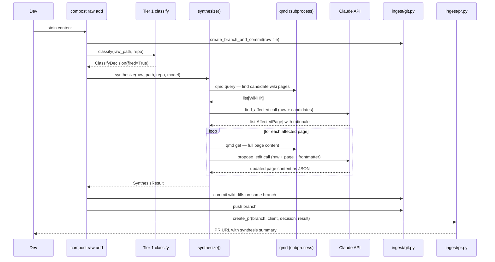

# Phase 4 High-Level Plan: Tier 2 Synthesis Agent

## Starting Prompt

> lets work on @_plans/2026-04-23-2149-laptop-steel-thread-high-level.md phase4, and make sure to pull in anything relevant from @_plans/backlog.md

---

## § Context

Phase 3 delivered the Tier 1 classifier: `compost raw add` now fires/no-fires on every ingestion and logs the decision to `.compost/classifications.jsonl`. The Gitea PR includes the classifier verdict in its body. Synthesis was explicitly out of scope until now.

Phase 4 closes the first real LLM loop: a raw file that fires Tier 1 automatically proposes wiki edits on the same branch, ready for human review before merge.

**Backlog items pulled in:**

The **synthesis pipeline observability dashboard** item from `backlog.md` is a first-class requirement here. Per the deferred-requirement callout in the high-level plan, the minimum viable form ships with Phase 4:
- Structured JSONL event log per synthesis run in `.compost/synth-log/`
- `compost synth log` view command showing inputs, outputs, cost, and pass/fail

The full dashboard (web UI, cost trend charts) remains deferred to Phase 8.

---

## § Modules

### New modules

```
tools/compost/
├── qmd.py                          # shared qmd query/get helpers (refactored out of mcp/tools.py)
└── synth/
    ├── __init__.py
    ├── agent.py                    # synthesize() — the main entry point
    ├── prompt.py                   # context assembly and prompt construction
    ├── diff_writer.py              # write/commit wiki diffs to working tree
    ├── log.py                      # per-run JSONL observability log
    └── prompts/
        ├── find_affected.md        # system prompt: given raw, find affected wiki pages
        └── propose_edit.md         # system prompt: given raw + page, propose updated content
```

### Modified modules

| File | Change |
|---|---|
| `mcp/tools.py` | Import `_qmd_query`, `_qmd_get` from `compost.qmd` instead of defining them locally |
| `ingest/pr.py` | `create_pr` gains optional `result: SynthesisResult \| None` param; includes wiki-edit summary in PR body |
| `cli.py` | Add `compost synth` group (`run`, `log`); update `raw_add` to call synthesis before push |
| `pyproject.toml` | Add `anthropic>=0.40`; add `compost.synth` to packages list |
| `tests/test_synth.py` | New test file (see § Test surface) |

---

## § Data flow



### `compost raw add` execution order change

Phase 3 order: commit raw → classify → push → open PR.

Phase 4 order: commit raw → classify → **synthesize (if fires) → commit wiki diffs** → push → open PR.

Push is intentionally delayed until after synthesis so the pushed branch contains both the raw file and any wiki edits in a single push. This keeps the Gitea PR atomic.

---

## § Core domain objects

```python
# tools/compost/synth/agent.py

from __future__ import annotations

import uuid
from dataclasses import dataclass, field
from pathlib import Path


@dataclass(frozen=True)
class FileDiff:
    rel_path: Path      # relative to repo root, e.g. wiki/services/payments.md
    content: str        # full replacement file content (not a patch)
    is_new: bool        # True when the wiki page does not yet exist


@dataclass(frozen=True)
class ContradictionNote:
    wiki_page: str      # rel_path string
    summary: str        # one sentence: what conflicts and with what


@dataclass(frozen=True)
class SynthesisResult:
    run_id: str
    wiki_diffs: list[FileDiff]
    pr_description: str
    cited_sources: list[str]
    declared_contradictions: list[ContradictionNote]


def synthesize(
    raw_path: Path,
    repo: Path,
    *,
    model: str = "claude-sonnet-4-6",
    dry_run: bool = False,
) -> SynthesisResult:
    """Query qmd for candidate wiki pages, call LLM to find affected pages,
    then propose edits for each. Pure when dry_run=True: no disk or git writes.
    """
    ...
```

```python
# tools/compost/synth/diff_writer.py

def apply_diffs(repo: Path, result: SynthesisResult) -> list[Path]:
    """Write FileDiff.content to working tree. Returns absolute paths written.

    Creates parent directories as needed. Does not touch git.
    """
    ...


def commit_diffs(repo: Path, written: list[Path], run_id: str) -> None:
    """Stage written paths and add a second commit on the current branch.

    Uses ingest.git.create_branch_and_commit with stage_only=True so the
    caller's branch is not changed.
    """
    ...
```

```python
# tools/compost/synth/log.py

def open_run(repo: Path, run_id: str) -> Path:
    """Create .compost/synth-log/{date}T{time}-{run_id}.jsonl. Return path."""
    ...


def log_event(log_path: Path, event_type: str, **kwargs) -> None:
    """Append one JSONL line: {"event": event_type, "ts": ..., **kwargs}."""
    ...


def read_runs(repo: Path, last: int = 10) -> list[dict]:
    """Read run_complete events from the last N log files, newest first."""
    ...
```

```python
# tools/compost/qmd.py  (refactored out of mcp/tools.py)

def qmd_query(query: str, index: str, collection: str, limit: int = 5) -> list[dict]:
    """BM25+vec search; returns hit dicts with keys: file, snippet, score, title."""
    ...


def qmd_get(file_uri: str, index: str) -> str:
    """Return full document text for a qmd:// URI or relative path."""
    ...
```

---

## § Prompt architecture

Two-phase LLM interaction per synthesis run:

**Phase A — find_affected (`find_affected.md`)**

Single call. System prompt: role + wiki-editing rules + output format (JSON array of `{page, rationale, is_new}`). User message: raw file content + list of candidate page summaries (title + snippet from qmd). Returns which pages need updating and why.

Model receives candidate page *snippets* (not full content) to keep token count bounded. Pages not in the candidate set are never proposed.

**Phase B — propose_edit (`propose_edit.md`)**

One call per affected page. System prompt: role + frontmatter rules (must update `sources`, `updated`, `confidence`; only add to `supersedes` if truly superseded; declare contradictions explicitly) + output format (JSON: `{content, cited_sources, contradictions}`). User message: raw file full text + full existing wiki page (prompt-cached). Returns complete replacement content.

**Prompt caching:** The `propose_edit` system prompt is a good candidate for caching via `cache_control: {"type": "ephemeral"}` on the system block, since it is identical across calls in the same run. Per-page wiki content in the user message is not cached (varies per call).

**Model config in `.compost.yml`:**

```yaml
synth:
  provider: anthropic       # only provider shipped in Phase 4
  model: claude-sonnet-4-6
  max_candidates: 10        # max qmd results fed into find_affected
```

Defaults apply when the `synth:` block is absent.

The config is parsed into a `SynthConfig` dataclass, and `synthesize()` accepts it rather than raw `model: str`. `agent.py` dispatches to a provider-specific call path keyed on `provider`. Phase 4 only implements `"anthropic"`, but the dispatch keeps the addition of `"openai"`, `"bedrock"`, or a custom endpoint to a single new branch plus a new call helper — nothing in `prompt.py`, `diff_writer.py`, or `log.py` knows about the provider.

```python
# tools/compost/synth/agent.py

from __future__ import annotations
from dataclasses import dataclass, field
from pathlib import Path


@dataclass(frozen=True)
class SynthConfig:
    provider: str = "anthropic"
    model: str = "claude-sonnet-4-6"
    max_candidates: int = 10


def load_synth_config(repo: Path) -> SynthConfig:
    """Read synth: block from .compost.yml; fall back to SynthConfig defaults."""
    ...


def synthesize(
    raw_path: Path,
    repo: Path,
    *,
    config: SynthConfig | None = None,   # None → load_synth_config(repo)
    dry_run: bool = False,
) -> SynthesisResult:
    ...
```

---

## § Observability log format

Each synthesis run produces `.compost/synth-log/{date}T{HHmmss}-{run_id}.jsonl`. Each line is a JSON event:

```jsonl
{"event": "run_start",      "run_id": "a1b2", "ts": "...", "raw": "raw/decisions/...", "model": "claude-sonnet-4-6"}
{"event": "qmd_candidates", "run_id": "a1b2", "ts": "...", "count": 8, "pages": ["wiki/services/payments.md", ...]}
{"event": "llm_call",       "run_id": "a1b2", "ts": "...", "call_n": 1, "purpose": "find_affected", "input_tokens": 1400}
{"event": "llm_response",   "run_id": "a1b2", "ts": "...", "call_n": 1, "output_tokens": 220, "cost_usd": 0.0012, "affected_count": 1}
{"event": "llm_call",       "run_id": "a1b2", "ts": "...", "call_n": 2, "purpose": "propose_edit", "page": "wiki/services/payments.md", "input_tokens": 2100}
{"event": "llm_response",   "run_id": "a1b2", "ts": "...", "call_n": 2, "output_tokens": 750, "cost_usd": 0.0038}
{"event": "diff_written",   "run_id": "a1b2", "ts": "...", "page": "wiki/services/payments.md", "is_new": false}
{"event": "run_complete",   "run_id": "a1b2", "ts": "...", "total_cost_usd": 0.005, "wiki_edits": 1, "contradictions": 0, "duration_s": 4.2}
```

`compost synth log` renders a Rich table: run_id, timestamp, raw file, wiki edits, contradictions, total cost, duration.

---

## § CLI design

```
compost synth run --raw <rel_path>
                 [--provider PROVIDER]   # override .compost.yml synth.provider
                 [--model MODEL]         # override .compost.yml synth.model
                 [--dry-run]             # propose edits but do not write to disk

compost synth log [--last N]             # default: last 10 runs
```

`raw add` gains `--no-synth` flag to skip synthesis even when Tier 1 fires.

CLI overrides apply only for that invocation; they are not written back to `.compost.yml`. `synthesize()` always receives a fully-resolved `SynthConfig` — CLI flags build a new `SynthConfig` rather than reaching into the config file.

Example output:

```
✓ raw/decisions/2026-05-02-drop-postgres.md
branch: raw/2026-05-02-drop-postgres
[Tier 1] FIRE — source:decision, semantic:decision
[Tier 2] synthesizing...
  candidates: 6 pages
  affected:   wiki/services/payments.md (update), wiki/modules/db-layer.md (update)
  2 wiki pages updated on branch
PR #7: http://localhost:3000/myteam/wiki/pulls/7
```

---

## § Integration: `compost raw add` changes

```python
# Pseudocode for new raw_add flow

create_branch_and_commit(repo, branch, [raw_file.path], message=f"raw: {title}")

decision = classify_and_log(raw_file, repo)   # existing Phase 3 logic

if decision and decision.fired and not no_synth:
    try:
        result = synthesize(raw_file.path, repo, dry_run=False)  # config loaded from .compost.yml
        if result.wiki_diffs:
            written = apply_diffs(repo, result)
            commit_diffs(repo, written, result.run_id)
            console.print(f"[green][Tier 2][/green] {len(result.wiki_diffs)} wiki page(s) updated")
        else:
            console.print("[dim][Tier 2] no wiki edits proposed[/dim]")
    except Exception as exc:
        console.print(f"[dim]⚠ synthesis failed: {exc}[/dim]")
        result = None
else:
    result = None

push_branch(repo, "origin", branch)
pr = create_pr(repo, branch, client, decision, result)
```

Synthesis errors are non-fatal (same pattern as classify errors in Phase 3).

---

## § `ingest/pr.py` change

`create_pr` gains `result: SynthesisResult | None = None`. When present, the PR body includes:

```markdown
**Tier 2 synthesis:**
- wiki/services/payments.md — updated (source: drop-postgres decision)
- wiki/modules/db-layer.md — updated (related module)

**Contradictions declared:** none

---
*Review and merge with `compost pr merge`.*
```

When `result.declared_contradictions` is non-empty, each contradiction is listed with its `wiki_page` and `summary`.

---

## § Frontmatter updates by synthesis agent

The `propose_edit` prompt instructs the LLM to produce updated frontmatter. Rules baked into the prompt:

- `sources`: append the raw file rel_path (do not remove existing sources)
- `updated`: set to today's date
- `confidence`: may increase or decrease based on new evidence; must justify in PR description
- `supersedes`: add only when the raw explicitly supersedes a prior decision
- `superseded_by`: leave unset (only a human or future synthesis run sets this)

The `propose_edit` output is a JSON object `{content: str, cited_sources: list[str], contradictions: list[{wiki_page, summary}]}` where `content` is the full replacement file text including frontmatter block. `diff_writer.py` writes this verbatim; no separate frontmatter merge step.

---

## § Structural triggers (deferred from Phase 3)

Phase 3 noted structural triggers (new service page, new API endpoint) require synthesis context. Phase 4 handles these naturally: the `find_affected` call can return `is_new: true` for a page that doesn't exist yet, causing `FileDiff.is_new = True` and a new wiki page to be created. No additional trigger logic needed; this falls out of the synthesis design.

---

## § Test surface

All LLM calls are patched with `unittest.mock.patch`. No real API calls in tests.

| Test | What it covers |
|---|---|
| `test_synthesize_dry_run_no_disk_writes` | `dry_run=True` never calls `apply_diffs`, no files created |
| `test_synthesize_returns_empty_when_no_candidates` | qmd returns nothing → empty `wiki_diffs`, safe to commit |
| `test_synthesize_returns_empty_when_llm_finds_no_affected` | Phase A returns empty list → no Phase B calls |
| `test_synthesize_calls_propose_edit_per_affected_page` | 2 affected pages → 2 LLM calls for Phase B |
| `test_synthesize_populates_result_fields` | run_id, wiki_diffs, cited_sources, contradictions populated |
| `test_apply_diffs_writes_new_page` | `is_new=True` creates file and parent dirs |
| `test_apply_diffs_overwrites_existing_page` | `is_new=False` replaces existing content |
| `test_apply_diffs_returns_absolute_paths` | returned paths are absolute |
| `test_log_event_appends_jsonl` | two log_event calls → two valid JSON lines |
| `test_log_open_run_creates_dir` | `.compost/synth-log/` created if missing |
| `test_read_runs_newest_first` | returns summaries sorted by filename descending |
| `test_qmd_refactor_mcp_tools_still_work` | mcp/tools.py imports from compost.qmd, same results |
| `test_raw_add_calls_synthesize_on_fire` | integration: raw_add with mocked synth produces wiki commit |
| `test_raw_add_no_synth_flag_skips` | `--no-synth` skips even when Tier 1 fires |
| `test_create_pr_body_includes_synthesis_result` | PR body lists wiki edits when result provided |
| `test_create_pr_body_no_synthesis_when_none` | `result=None` → no Tier 2 section in PR body |

---

## § pyproject.toml changes

```toml
dependencies = [
    "anthropic>=0.40",
    ...existing...
]

[tool.setuptools]
packages = [
    ...existing...,
    "compost.synth",
]
```

---

## § Documentation updates

- `README.md`: add `## Tier 2 Synthesis` section after the existing `## Tier 1 Classifier` section, showing example output from `compost raw add` and `compost synth run --dry-run`.
- No changes to `TEAM.md` in the wiki repo at this phase (Phase 3 note said to add classifier rules after Phase 3, which is separate).

---

## § Red flags anticipated

| Red flag | Where | Mitigation |
|---|---|---|
| Temporal decomposition | `synth/agent.py` structured as "step 1 find, step 2 edit" | Structure around data transforms (`candidates → affected → diffs`), not execution steps |
| Information leakage | `diff_writer.py` knowing frontmatter field names | Frontmatter rules belong in the prompt; diff_writer only writes strings |
| Shallow module | `synth/log.py` being thin wrappers | `log_event` handles timestamp injection, JSONL serialization, and file-not-found creation — earning its keep |
| Pass-through | `synthesize()` delegating each step to its own module | Each module (`prompt.py`, `log.py`, `diff_writer.py`) provides a genuinely different abstraction level; `agent.py` is the orchestrator, not a pass-through |
| LLM output parsing fragility | JSON parse failures from LLM | Parse failures return empty `wiki_diffs` (graceful degradation, logged as event), never raise to caller |

---

*High-level plan ready for review. Run `/plan-impl:plan` on Phase 4 impl once this looks right.*

---

### Feedback Log

**Model/provider config — pluggable provider shape**
> Original comment (verbatim): `^^ does the compost config assume we'll be only ever be calling anthropic directly? I think that is fine for now, but we should make sure to model that as something pluggable so I can swap out to different providers and models as needed ^^`
>
> Context: appeared under the `synth:` YAML block in § Prompt architecture, after `model: claude-sonnet-4-6`.
>
> Incorporated: added `provider: anthropic` to the `.compost.yml` config block; introduced a `SynthConfig` dataclass that `synthesize()` accepts instead of a raw `model: str` string; `agent.py` dispatches to a provider-specific call path keyed on `config.provider`; `compost synth run` gains `--provider` and `--model` override flags. Phase 4 only ships the `"anthropic"` path; adding a new provider requires only a new branch in the dispatch plus a call helper.
