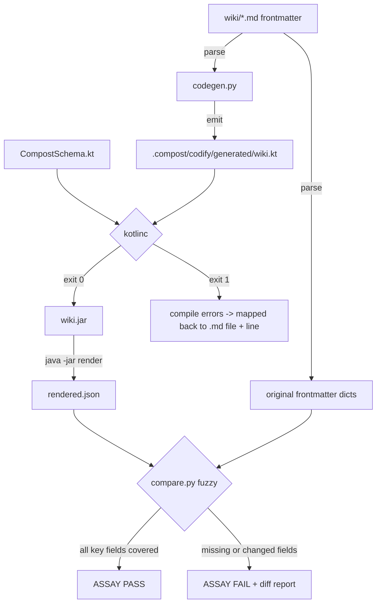
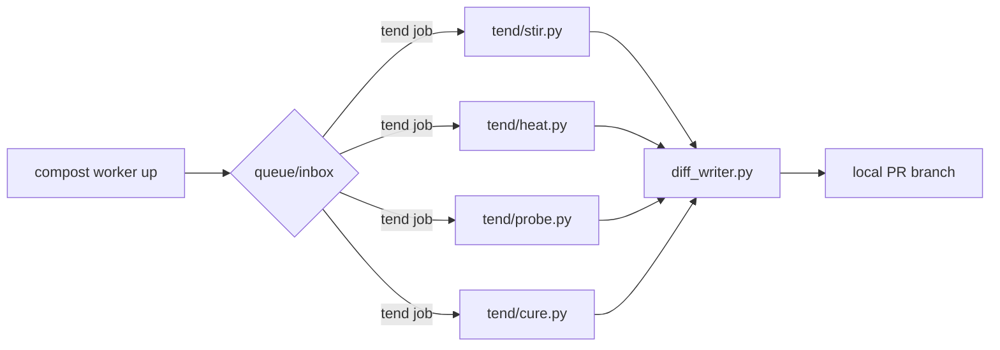

# Kotlin Consistency Layer, High-Level Plan

## Starting Prompt

> already lets use /plan to think carefully about this. please consult previous plans as well as
> @implementation-handoff.md @team-context-research-spec.md @team-context-spec.md
>
> Context from conversation:
> - Option B: markdown primary, Kotlin derived via `compost codify`
> - `kotlinc` compile as consistency oracle (like `go build` in winze)
> - `compost assay` for round-trip validation (codify -> compile -> render -> fuzzy compare)
> - Compost-themed metabolism naming: `stir`, `heat`, `probe`, `cure`, `tend`
> - Kotlin over Go for better sealed classes, data classes, annotation support

---

## § Context and design constraints

This plan introduces a typed Kotlin substrate for the wiki, inspired by
[winze](https://github.com/justinstimatze/winze)'s "knowledge as code" approach. Winze uses Go
source as its consistency oracle: `go build` catches structural errors, typed predicates make
contradictions first-class. Compost's wiki is markdown-primary; the Kotlin layer is derived,
not authored. The compile pass is the oracle, not a human artifact.

**Fundamental invariant:** markdown frontmatter is the single source of truth. Kotlin is always
derived. If there is ever a conflict between the two, the markdown wins and the Kotlin is
regenerated.

**Red flags anticipated and addressed:**

- *Information leakage*: frontmatter schema lives in `model/frontmatter.py`. Kotlin schema types
  must mirror it. Risk: two sources of truth. Mitigation: the Kotlin schema file
  (`CompostSchema.kt`) is a static versioned template; Python codegen reads wiki frontmatter and
  emits `wiki.kt` that instantiates those types. The Python frontmatter model is canonical.
  Schema changes require updating both; schema changes are infrequent and mechanical.

- *Temporal decomposition*: the assay pipeline is sequential (codify -> compile -> render ->
  compare). Each step has a distinct purpose. This is intentional layering, not temporal
  decomposition.

- *Punting complexity*: `compost codify` and `compost assay` check for `kotlinc`/`java` and emit
  a clear install message if missing. The commands degrade gracefully: codify without compile is
  still useful as a schema lint.

---

## § Phase placement

The [steel-thread plan](2026-04-23-2149-laptop-steel-thread-high-level.md) phases 1-4 are done.
This feature inserts as a new **Phase 5: Kotlin Consistency Layer**, shifting existing phases by
one. The adversarial checks (original Phase 5) become Phase 6, and so on. The rationale: the
Kotlin substrate should be in place before the adversarial checks, because the contradiction scan
(one of the six adversarial checks) can use the compiled Kotlin rather than a separate LLM call.

Updated phase sequence:

```
Phase 4  [DONE]  Tier 2 synthesis agent
Phase 5  [NEW]   Kotlin consistency layer (codify, assay, @Contested lint)
Phase 6  [was 5] Adversarial checks (contradiction scan now uses kotlinc output)
Phase 7  [was 6] Research capability, grounding gate, stub-and-promote
Phase 8  [was 7] Local shims for async ingestion sources
Phase 9  [was 8] Long-running synthesis daemon + compost tend (metabolism)
Phase 10 [was 9] Lifecycle lint pass and weekly report
Phase 11 [was 10] Second local repo + engineering layer + federation
Phase 12 [was 11] Derived artifacts
```

The `compost tend` metabolism subcommands (`stir`, `heat`, `probe`, `cure`) land in **Phase 9**,
co-located with the long-running daemon. Metabolism phases need a background worker to be
genuinely useful; they are expensive to run on demand and benefit from the queue/dead-letter
infrastructure Phase 9 builds.

---

## § Prerequisites: Kotlin toolchain

For the laptop steel thread, install Kotlin via SDKMAN. SDKMAN manages JVM toolchains without
touching system Java and is the recommended path for this scope.

```bash
# Install SDKMAN (if not already installed)
curl -s "https://get.sdkman.io" | bash
source "$HOME/.sdkman/bin/sdkman-init.sh"

# Install Kotlin (includes kotlinc and the JVM runtime)
sdk install kotlin

# Verify
kotlinc -version   # should print "kotlinc-jvm X.X.X ..."
java -version      # should print JVM version
```

`compost codify --compile` checks for `kotlinc` on PATH and prints the SDKMAN install command
above if it is missing.

Production promotion path: SDKMAN installs stay per-user on the laptop. When this moves to CI
(Phase 9 worker or GitHub Actions), swap SDKMAN for the standard Kotlin GitHub Action
(`actions/setup-java` + `actions/setup-kotlin`). No code changes required.

---

## § High-level plan

### What Phase 5 ships

1. **`compost codify`**: reads all wiki markdown files, generates a single `wiki.kt` bundle into
   `.compost/codify/generated/wiki.kt`. Every wiki page becomes a typed Kotlin value.

2. **Kotlin schema (`CompostSchema.kt`)**: a static file versioned with the compost package,
   containing the base types (`WikiPage`, `Provenance`, predicate types). Shipped as a package
   resource, not user-authored.

3. **`kotlinc` compile check**: `kotlinc CompostSchema.kt wiki.kt` passes = structural
   consistency. Errors surfaced as human-readable messages mapping back to the originating
   markdown files.

4. **`compost assay`**: the round-trip. Codify -> compile -> execute a render main() ->
   deserialize output -> fuzzy field-coverage compare against original frontmatter. A `pass`
   means no key fields were dropped or changed meaning during the codify step.

5. **`@Contested` lint**: any wiki page with `type: decision` or `type: concept` that has two
   or more pages sharing the same `name` (or `aliases`) produces a `Disputes` declaration in the
   generated Kotlin, annotated `@Contested`. `kotlinc` does not fail on this by default; a
   separate lint pass (`compost lint contested`) queries the compiled output.

6. **Integration with Phase 4**: `compost raw add` gains an `--assay` flag. When present,
   synthesis runs first (Phase 4), then `compost assay` validates the resulting wiki diffs before
   the commit.

---

## § Module layout (new modules only)

```
tools/compost/
├── codify/
│   ├── __init__.py
│   ├── codegen.py         # wiki frontmatter -> Kotlin AST -> wiki.kt
│   ├── renderer.py        # invoke compiled jar, capture JSON output, parse
│   ├── compare.py         # fuzzy field-coverage comparison
│   └── schema/
│       ├── CompostSchema.kt   # base types; versioned template
│       └── render_main.kt     # main() that serializes all wiki pages to JSON
```

Existing modules modified:

- `cli.py` — new `codify` command group, new `assay` command, `--assay` flag on `raw add`
- `synth/agent.py` — optional post-synthesis assay pass (when `--assay` is set)
- `model/frontmatter.py` — no structural changes; codegen reads it to derive the Kotlin types
- `tests/test_codify.py` — new

---

## § Data flow: `compost codify` and `compost assay`



**Fuzzy compare rules:**

| Pass condition | Rationale |
|---|---|
| All `required` frontmatter fields present in rendered JSON | Structural completeness |
| String values equal after normalisation (trim, lowercase) | Encoding drift tolerance |
| List fields: same members regardless of order | List ordering is not semantic |
| Optional fields: absent-in-rendered is acceptable if absent-in-source | No false positives for optional fields |
| Confidence float: within 0.05 of original | Float precision drift tolerance |

---

## § Data flow: `compost tend` (Phase 9)

The metabolism commands run in the background worker process. Each subcommand produces a local
PR (same atomic PR model as raw ingestion). The worker logs progress to
`.compost/tend-log/{ts}-{phase}.jsonl`.



| Command | Winze analogue | What it does |
|---|---|---|
| `compost tend stir` | NREM dream | Orphan page bridging, provenance gaps, stale `updated` field, missing `sources` |
| `compost tend heat` | REM trip | Speculative cross-page links, new page proposals from raw cluster analysis |
| `compost tend probe` | Bias audit | Source concentration HHI, orphan rate, confidence distribution |
| `compost tend cure` | Calibrate | Track high-confidence pages unchanged despite new raw activity |
| `compost tend` | Full cycle | stir -> probe -> heat -> cure in order |

---

## § Core domain objects

### Kotlin schema (CompostSchema.kt)

```kotlin
// Shipped as a package resource. User never edits this file.

data class Provenance(
    val origin: String,     // raw file path that produced this claim
    val ingestedAt: String, // ISO-8601 date
    val ingestedBy: String  // "compost-synth" or human author name
)

sealed class WikiPage {
    abstract val id: String
    abstract val title: String
    abstract val confidence: Float
    abstract val prov: Provenance
    abstract fun render(): Map<String, Any>
}

data class ServicePage(
    override val id: String,
    override val title: String,
    override val confidence: Float,
    override val prov: Provenance,
    val owner: String,
    val tier: Int,
    val dependsOn: List<String> = emptyList(),
    val technology: List<String> = emptyList()
) : WikiPage() {
    override fun render() = mapOf(
        "id" to id, "title" to title, "type" to "service",
        "confidence" to confidence, "owner" to owner, "tier" to tier,
        "depends_on" to dependsOn, "technology" to technology,
        "sources" to listOf(prov.origin)
    )
}

data class DecisionPage(
    override val id: String,
    override val title: String,
    override val confidence: Float,
    override val prov: Provenance,
    val status: String,
    val supersedes: List<String> = emptyList()
) : WikiPage() { override fun render() = mapOf(...) }

// similar for RunbookPage, ConceptPage, PersonPage, IncidentPage

// Typed predicate for contested claims
@Target(AnnotationTarget.PROPERTY)
annotation class Contested

data class TheoryOf(
    val subject: WikiPage,
    val claim: String,
    val prov: Provenance
)

data class Disputes(
    val claimA: TheoryOf,
    val claimB: TheoryOf,
    val prov: Provenance
)
```

### Python codegen interface (codegen.py)

```python
@dataclass
class CodegenResult:
    kt_path: Path              # .compost/codify/generated/wiki.kt
    page_count: int
    dispute_count: int         # pages with @Contested declarations
    warnings: list[str]        # non-fatal issues (unknown frontmatter keys, etc.)

def codify(repo: Path, *, wiki_dir: Path | None = None) -> CodegenResult:
    """Read all wiki/*.md frontmatter, emit wiki.kt into .compost/codify/generated/.
    Does not compile. Does not require kotlinc."""

@dataclass
class CompileResult:
    success: bool
    errors: list[CompileError]   # each error mapped back to originating .md file
    jar_path: Path | None

@dataclass
class CompileError:
    kt_line: int
    message: str
    source_md: Path | None   # best-effort mapping from generated line -> wiki page

def compile_kt(repo: Path) -> CompileResult:
    """Run kotlinc against the generated wiki.kt. Requires kotlinc on PATH."""
```

### Python assay interface (compare.py)

```python
@dataclass
class AssayResult:
    passed: bool
    checked: int               # number of pages compared
    failures: list[AssayFailure]

@dataclass
class AssayFailure:
    page_id: str
    source_md: Path
    missing_fields: list[str]
    changed_fields: list[tuple[str, Any, Any]]  # (field, original, rendered)

def assay(repo: Path) -> AssayResult:
    """Full round-trip: codify -> compile -> render -> compare.
    Returns AssayResult. Never raises on comparison failure; raises only on
    infrastructure errors (kotlinc not found, compile error, etc.)."""
```

---

## § CLI surface

```
compost codify [--wiki-dir PATH] [--out PATH]
    Generate .compost/codify/generated/wiki.kt from all wiki markdown pages.
    Prints summary: N pages, N disputes, warnings.

compost codify --compile
    codify + kotlinc compile. Exits nonzero on compile error.
    Maps compile errors back to originating .md files.

compost assay [--wiki-dir PATH]
    Full round-trip: codify, compile, render, fuzzy compare.
    Prints per-page PASS/FAIL. Exits nonzero if any page fails.

compost assay --report
    Same but emits a markdown report to .compost/assay-report.md

compost raw add ... [--assay]
    Run assay after synthesis, before git commit. Fails the add if assay fails.

# Phase 9 (shown here for completeness):
compost tend [--stir] [--heat] [--probe] [--cure]
    Run one or more metabolism phases. Default (no flags): run all.
    Each phase opens a local PR if it produces any diffs.
```

---

## § Integration with Phase 6 adversarial checks

The original Phase 5 contradiction scan used a separate LLM call to detect contradicting claims
across wiki pages. With the Kotlin substrate in place, the contradiction scan becomes:

1. Run `compost codify --compile` (cheap, deterministic).
2. Parse `Disputes` declarations from the generated Kotlin (grep-level complexity).
3. Flag any `@Contested` pages that have two competing `TheoryOf` declarations.
4. The LLM call (previously the full scan) is now only invoked for pages that are NOT already
   captured as formal `Disputes` records — i.e. to find *new* contradictions the Kotlin doesn't
   know about yet.

This is a concrete improvement in the adversarial check cost profile: cheap deterministic gate
first, expensive LLM fallback only when needed.

---

## § `compost tend` metabolism phases (Phase 9 detail)

### `stir` (consolidation)

Inputs: all wiki pages, all raw files.

Algorithm:
1. Find wiki pages with no `sources` frontmatter entry. Queue a synthesis run.
2. Find wiki pages with `updated` older than 90 days that have new raw files since `updated`.
   Queue a re-synthesis.
3. Find wiki pages with no `related` links and >1 page sharing a keyword. Propose a link.

Output: a synthesis job per finding, batched into a single PR.

### `heat` (speculative)

Inputs: raw cluster analysis (qmd embeddings), existing wiki page graph.

Algorithm:
1. Query qmd for the top 20 raw files most semantically distant from any existing wiki page.
2. For each, ask: "does this describe a concept not yet in the wiki?" (LLM call).
3. Proposed new wiki stubs emitted as diffs.

Output: PR with new stub pages, marked `confidence: low`, `sources` pointing to triggering raw.

### `probe` (structural health)

Inputs: wiki pages, raw files, provenance records.

Checks (deterministic, no LLM):
- Source concentration: what % of raw files come from each source type? Flag if any single
  source type exceeds 70% (availability heuristic analog).
- Orphan rate: pages with no `related` entries and no inbound links.
- Confidence distribution: flag if >50% of pages are `confidence: high` (Dunning-Kruger analog).
- Stale provenance: pages with `sources` pointing to raw files that no longer exist.

Output: markdown health report + probe log JSONL.

### `cure` (calibration)

Inputs: historical assay results (`.compost/assay-log/`), wiki page confidence scores.

Algorithm:
1. Track which `confidence: high` pages have drifted in subsequent assay runs (field value
   changes between assay snapshots).
2. Pages that drift frequently despite `confidence: high` are flagged for confidence downgrade.
3. Pages with stable assay results for 30+ days and `confidence: medium` are candidates for
   upgrade (proposed by LLM, human-confirmed).

Output: PR with frontmatter `confidence` adjustments.

---

## § Docs that need updating

| File | What changes |
|---|---|
| `tools/compost/README.md` | Add `compost codify` and `compost assay` to command reference. Add "Kotlin consistency layer" section explaining the oracle model. |
| `AGENTS.md` | Add Kotlin tooling convention: `compost codify --compile` requires `kotlinc` on PATH; install via SDKMAN (`sdk install kotlin`). Add note: `CompostSchema.kt` is a versioned package resource, never edit directly. Add CI promotion note: swap SDKMAN for `actions/setup-java` + `actions/setup-kotlin` when moving to GitHub Actions. |
| `_plans/backlog.md` | Remove "Synthesis pipeline observability dashboard" section (landed in Phase 4). Update winze and hybrid sections to cross-reference this plan. |
| Steel-thread high-level | Phase numbering is now shifted by 1 from Phase 5 onward. Update the mermaid phase diagram. |

---

## § What this plan does NOT promise

- No Kotlin type inference for frontmatter fields not in the current schema (e.g., custom `type`
  values added by users). Unknown types are emitted as `UnknownPage` with a `toMap()` returning
  raw frontmatter. Compile still passes; assay fuzzy compare ignores `UnknownPage` entries.
- No LSP or IDE integration for the generated Kotlin. It is a consistency artifact, not a
  developer authoring surface.
- No two-way sync: Kotlin -> markdown is never supported. The markdown is always primary.
- `compost tend heat` is speculative and expensive; it is opt-in and requires `ANTHROPIC_API_KEY`.
  The other `tend` subcommands are deterministic and free.
