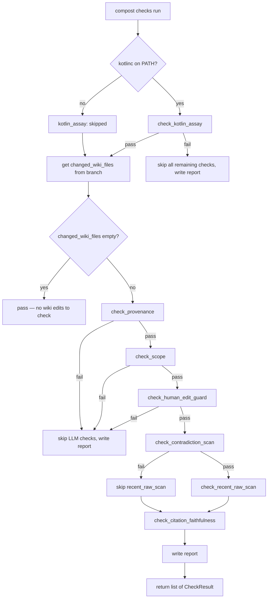
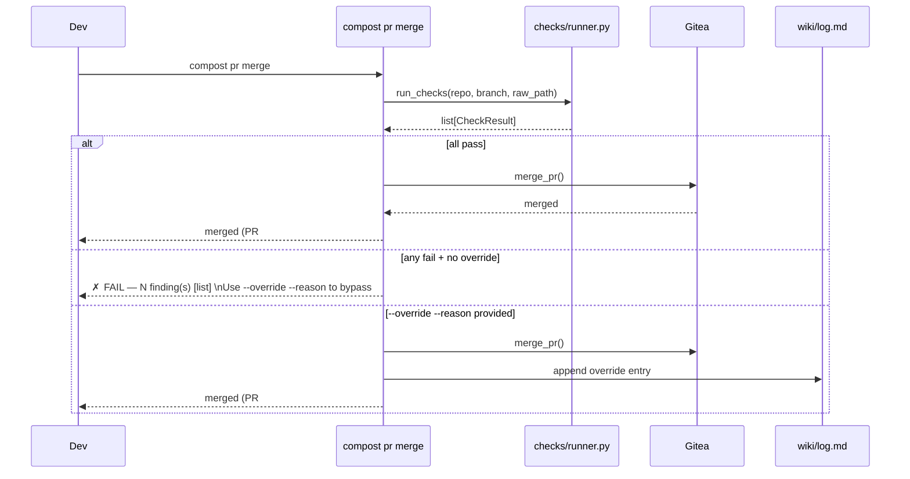

# Phase 5: Tier 2.5 Adversarial Checks, High-Level Plan

## Starting Prompt

> @_plans/2026-04-23-2149-laptop-steel-thread-high-level.md phase 5. please pull in anything appropriate from @_plans/backlog.md

---

## § Context

Phase 5 closes the ingestion loop. After Phase 4's synthesis agent proposes wiki edits, a battery
of adversarial checks verifies the edits before merge. The checks are designed to find falsifying
evidence, not to rubber-stamp synthesis output (spec §4.1).

**What already exists:**
- `ContradictionNote` in `synth/agent.py` — LLM-declared contradictions from synthesis (free text,
  in the PR description). The adversarial checks are independent of and do not depend on these.
- `compost pr merge` — merges the current branch via Gitea. Needs gating on check results.
- `changed_files(repo, branch, base)` in `ingest/git.py` — finds wiki files changed on a branch.
- `qmd_query` and `qmd_get` in `qmd.py` — available for scope and LLM-augmented checks.
- The Kotlin consistency layer (`compost assay`) — already runnable independently; not integrated
  into the check gate in this phase (see backlog).

**What this phase delivers:**
- `tools/compost/checks/` package with one module per check.
- `compost checks run` CLI command.
- `compost pr merge` gated on check results, with `--override --reason "..."` escape hatch.
- Structured `Finding` objects (not free text) for contradiction findings, enabling a future path
  to `claims.kt` entries (backlog: "Disputes as a first-class predicate").
- PR-comment-shaped report written to `.compost/checks/{branch-slug}.md`.

**Backlog items pulled in:**
- *Disputes as a first-class predicate (winze section):* "Phase 5's adversarial check gate should
  produce structured contradiction records, not free-text observations." Addressed by the rich
  `Finding` type: contradiction findings carry `page`, `claim_text`, `conflicting_page`, and
  `conflicting_claim_text` — enough for a future `compost claims suggest` to write `claims.kt`
  entries automatically.
- *Kotlin consistency layer:* `compost assay` runs independently. It is now integrated as check #0
  in this phase. If `kotlinc` is not on PATH, check #0 is skipped with reason "kotlinc not found"
  (graceful degradation, same behavior as `raw add --assay`). A compile failure short-circuits all
  remaining checks.

---

## § The six checks

Ordered cheapest to most expensive. Short-circuit: if any check in the "deterministic" tier fails,
skip all LLM-based checks. Report always shows what ran and what was skipped and why.

| # | Name | Tier | Cost | What it checks |
|---|------|------|------|----------------|
| 0 | `kotlin_assay` | kotlin | free (if kotlinc present) | Wiki Kotlin layer compiles and passes invariants |
| 1 | `provenance` | deterministic | free | All changed wiki pages have non-empty `sources` |
| 2 | `scope` | qmd-based | cheap | Changed pages are semantically connected to triggering raw |
| 3 | `human_edit_guard` | git-based | free | Agent is not reverting a human edit from the last 30 days |
| 4 | `contradiction_scan` | LLM | moderate | New claims don't contradict the rest of the wiki |
| 5 | `recent_raw_scan` | LLM | moderate | New claims don't contradict raw from the last 90 days |
| 6 | `citation_faithfulness` | LLM | expensive | Cited sources actually support the claims they back |

**Short-circuit tiers:**
- `kotlin_assay` failure (check 0): skip all remaining checks. A compile failure means the wiki's
  structural layer is broken; no other check is meaningful until it compiles. If kotlinc is absent,
  check 0 is skipped (not a failure) and the remaining checks proceed normally.
- Deterministic failures (checks 1-3): skip all LLM checks (4-6). Reason: if the page lacks
  sources or is out-of-scope, running citation faithfulness is meaningless.
- Contradiction scan failure (check 4): skip recent_raw_scan (5). Both are contradiction-type
  checks; a wiki contradiction already signals a human-review need. Citation faithfulness (6)
  still runs — it answers a different question (source integrity, not claim consistency).

---

## § Module layout

```
tools/compost/checks/
├── __init__.py            (empty)
├── runner.py              (CheckResult, Finding, ChecksConfig, run_checks())
├── kotlin_assay.py        (check_kotlin_assay() — delegates to compost.codify.*)
├── provenance.py          (check_provenance())
├── scope.py               (check_scope())
├── human_edit_guard.py    (check_human_edit_guard())
├── contradiction.py       (check_contradiction_scan())
├── recent_raw.py          (check_recent_raw_scan())
└── citation.py            (check_citation_faithfulness())
```

`check_kotlin_assay` imports `codify`, `compile_kt`, and `render_wiki` from `compost.codify.*`
directly rather than shelling out to `compost assay`. This avoids subprocess overhead and means
errors surface as Python exceptions rather than exit codes.

Added to `pyproject.toml` packages list: `"compost.checks"`.

---

## § Core domain objects

```python
# tools/compost/checks/runner.py

from __future__ import annotations
from dataclasses import dataclass, field
from pathlib import Path
from typing import Literal

@dataclass(frozen=True)
class Finding:
    check: str
    severity: Literal["fail", "warn"]
    message: str
    page: str | None = None
    # Populated only for contradiction findings; enables future claims.kt generation
    conflicting_page: str | None = None
    claim_text: str | None = None
    conflicting_claim_text: str | None = None

@dataclass
class CheckResult:
    name: str
    status: Literal["pass", "fail", "skipped"]
    findings: list[Finding]
    cost_usd: float = 0.0
    duration_s: float = 0.0
    skip_reason: str | None = None

@dataclass
class ChecksConfig:
    provider: str = "anthropic"
    model: str = "claude-sonnet-4-6"
    human_edit_days: int = 30          # lookback for human-edit guard
    recent_raw_days: int = 90          # lookback for recent-raw scan
    scope_min_score: float = 0.15      # qmd score below this = out-of-scope
    scope_top_n: int = 10              # candidates to retrieve for scope check

def run_checks(
    repo: Path,
    branch: str,
    raw_path: Path | None = None,
    *,
    config: ChecksConfig | None = None,
) -> list[CheckResult]:
    """Run all six checks in order, short-circuiting on deterministic failures.

    Returns results for all checks (including skipped ones with skip_reason set).
    Never raises on check failure; only raises on infrastructure errors (git, qmd not found).
    """
```

Each individual check function signature follows the same pattern:

```python
def check_kotlin_assay(
    repo: Path,
) -> CheckResult: ...  # skipped (not failed) when kotlinc absent

def check_provenance(
    repo: Path,
    changed_wiki_files: list[Path],
) -> CheckResult: ...

def check_scope(
    repo: Path,
    changed_wiki_files: list[Path],
    raw_path: Path,
    config: ChecksConfig,
) -> CheckResult: ...

def check_human_edit_guard(
    repo: Path,
    changed_wiki_files: list[Path],
    config: ChecksConfig,
    base_branch: str = "main",
) -> CheckResult: ...

def check_contradiction_scan(
    repo: Path,
    changed_wiki_files: list[Path],
    config: ChecksConfig,
) -> CheckResult: ...

def check_recent_raw_scan(
    repo: Path,
    changed_wiki_files: list[Path],
    raw_path: Path,
    config: ChecksConfig,
) -> CheckResult: ...

def check_citation_faithfulness(
    repo: Path,
    changed_wiki_files: list[Path],
    config: ChecksConfig,
) -> CheckResult: ...
```

---

## § Check implementation notes

### 0. Kotlin assay (kotlin, optional)

Check if `kotlinc` is on PATH via `shutil.which("kotlinc")`. If absent, return a `CheckResult`
with `status="skipped"` and `skip_reason="kotlinc not found"`.

If present:
1. Call `codify(repo)` → `CodegenResult`. If codegen warns or fails, emit findings.
2. Call `compile_kt(repo)` → `CompileResult`. If `not success`: return fail with one `Finding`
   per `CompileError` (message, source_md for context).
3. Call `render_wiki(repo)` → reads `wiki.jar` output. If the jar exits nonzero (invariant
   violation: contested page with confidence > 0.8), emit a fail finding naming the offending page.

Finding for compile errors:
```python
Finding(check="kotlin_assay", severity="fail",
        message=f"compile error: {err.message}", page=err.source_md)
```

Finding for invariant violations (render nonzero exit):
```python
Finding(check="kotlin_assay", severity="fail",
        message="invariant violated: contested page has confidence > 0.8", page=page_id)
```

### 1. Provenance (deterministic)

Read frontmatter `sources` from each changed wiki file. Fail if any file has an empty or absent
`sources` list. No LLM, no network.

### 2. Scope (qmd-based)

Use the first 300 chars of the raw body (after stripping frontmatter — same fix as the qmd query
bug from synthesis) as a query. Run `qmd_query` against the `wiki` collection. If none of the
changed wiki files appear in the top-N results with score ≥ `scope_min_score`, emit a fail finding
for that page. If `raw_path` is not provided (checks run without a triggering raw), this check is
skipped with reason "no triggering raw".

### 3. Human-edit guard (git-based)

For each changed wiki file: run `git log --follow --since="{N} days ago" --format="%H %ae %s"
-- {file}`. Filter to commits where the subject does NOT start with `synth:` or `raw:` (i.e.,
human-authored commits). If any such commits exist within the lookback window, read their diffs
(`git show --stat {sha}`) and check if the current branch diff (`git diff {base}...{branch} --
{file}`) overlaps substantially (same section headings changed). If overlap found, fail.

For the laptop steel thread, "human commit" = any commit not authored by the synthesis commit
pattern. This is intentionally simple and can be tightened in Phase 8 when we have a proper
author identity for the synth worker.

### 4. Contradiction scan (LLM)

For each changed wiki file:
1. Fetch the new content (`git show {branch}:{file}`).
2. Use `qmd_query` with the new content to find up to 5 other wiki pages that might conflict.
3. Call LLM with: new page content + candidate pages + prompt asking "identify any claims in the
   new content that directly contradict claims in the existing pages."
4. Parse response into structured `Finding` objects with `page`, `conflicting_page`,
   `claim_text`, `conflicting_claim_text`.

LLM output schema:
```json
{
  "contradictions": [
    {
      "page": "wiki/services/payments.md",
      "claim_text": "Stripe calls are processed asynchronously via queue",
      "conflicting_page": "wiki/decisions/0001-stripe-as-payment-processor.md",
      "conflicting_claim_text": "Stripe SDK retries are synchronous with max_network_retries=2"
    }
  ]
}
```

Already-declared contradictions (from `synth/agent.py`'s `ContradictionNote`) are not considered
failures — if synthesis explicitly declared a contradiction, the human reviewer already sees it.
The check only fails on **undeclared** contradictions.

### 5. Recent-raw scan (LLM)

Find raw files modified in the last 90 days (`git log --diff-filter=A --since="{N} days ago"
--name-only -- raw/`). Exclude the triggering raw itself. Take up to 10 most recent. For each
changed wiki file, ask LLM: "do any of these recent raw files contain claims that contradict the
new wiki content?" Same structured output as contradiction scan.

### 6. Citation faithfulness (LLM)

For each changed wiki file:
1. Read `sources` frontmatter.
2. Load each source file's body text (`qmd_get` or direct read if local path).
3. Call LLM with: new wiki content + source texts + prompt: "for each substantive claim in the
   new wiki content, identify whether it is supported by the provided sources. Flag any claim that
   is not supported or that the source text contradicts."
4. Emit findings for unsupported claims.

---

## § Data flow





---

## § CLI additions

### `compost checks run`

```
compost checks run [--branch BRANCH] [--raw RAW_PATH] [--report]
```

- `--branch`: defaults to current branch
- `--raw`: path to the triggering raw file (used by scope and recent-raw checks); inferred from
  branch commits if omitted
- `--report`: write markdown report to `.compost/checks/{branch-slug}.md` (default: always write)

Output (Rich table + per-check findings):
```
  Check                Status    Findings    Cost (USD)    Duration (s)
  provenance           ✓ pass           0        0.0000             0.0
  scope                ✓ pass           0        0.0000             0.2
  human_edit_guard     ✓ pass           0        0.0000             0.1
  contradiction_scan   ✗ FAIL           1        0.0041             2.3
  recent_raw_scan      — skipped        —             —               —
  citation_faithfulness — skipped       —             —               —

✗ 1 finding(s):
  contradiction_scan: wiki/services/payments.md
    claim: "Stripe calls are processed asynchronously via queue"
    conflicts with wiki/decisions/0001-stripe-as-payment-processor.md:
    "Stripe SDK retries are synchronous with max_network_retries=2"
```

### `compost pr merge` updates

Add `--override` and `--reason` options. Before calling `merge_pr()`:
1. Run `run_checks(repo, branch, raw_path=_infer_raw_path(repo, branch))`.
2. If any check fails and `--override` not set: print findings and exit 1.
3. If `--override` and `--reason`: merge, then append to `wiki/log.md`:
   ```
   ## Override: {branch} ({ts})
   Reason: {reason}
   Findings bypassed: {list of failed check names}
   ```
4. Add `--no-checks` flag to skip the check gate entirely (for raw-only PRs without wiki edits,
   or when kotlinc/LLM is unavailable).

### `.compost.yml` checks config block

```yaml
checks:
  provider: anthropic
  model: claude-sonnet-4-6
  human_edit_days: 30
  recent_raw_days: 90
  scope_min_score: 0.15
```

Falls back to `ChecksConfig` defaults if absent.

---

## § Report format

Written to `.compost/checks/{branch-slug}.md` after every `compost checks run` or `compost pr merge`:

```markdown
# Checks: raw/2026-05-04T161353-switch-payments-service-to-async-stripe-calls
Generated: 2026-05-04 16:14 UTC

| Check | Status | Findings | Cost | Duration |
|-------|--------|----------|------|----------|
| provenance | ✓ pass | 0 | $0.0000 | 0.0s |
| scope | ✓ pass | 0 | $0.0000 | 0.2s |
| human_edit_guard | ✓ pass | 0 | $0.0000 | 0.1s |
| contradiction_scan | ✗ FAIL | 1 | $0.0041 | 2.3s |
| recent_raw_scan | — skipped | — | — | — |
| citation_faithfulness | — skipped | — | — | — |

**Short-circuit:** contradiction_scan failed → skipped: recent_raw_scan

## Findings

### contradiction_scan
**wiki/services/payments.md** (fail)
- Claim: "Stripe calls are processed asynchronously via queue"
- Conflicts with `wiki/decisions/0001-stripe-as-payment-processor.md`:
  "Stripe SDK retries are synchronous with max_network_retries=2"
```

`.compost/checks/` is added to `.gitignore` (generated artifact; the Gitea PR body is the
authoritative copy for human review).

---

## § Tests

**New file:** `tools/compost/tests/test_checks.py`

Unit tests (no LLM calls, mock qmd):
- `test_kotlin_assay_skipped_when_kotlinc_absent` (mock `shutil.which` returning None)
- `test_kotlin_assay_fails_on_compile_error` (mock `compile_kt` returning failure)
- `test_kotlin_assay_passes_on_clean_wiki` (skip marker: `kotlinc_available`)
- `test_provenance_passes_when_sources_present`
- `test_provenance_fails_when_sources_empty`
- `test_provenance_fails_when_sources_absent`
- `test_scope_skipped_when_no_raw_path`
- `test_scope_fails_when_page_not_in_qmd_results`
- `test_scope_passes_when_page_in_qmd_results`
- `test_human_edit_guard_passes_when_no_human_commits`
- `test_human_edit_guard_fails_when_human_commit_overlaps`
- `test_run_checks_short_circuits_on_provenance_fail` (provenance fails → 4 checks skipped)
- `test_run_checks_short_circuits_on_scope_fail`
- `test_run_checks_contradiction_fail_skips_recent_raw_not_citation`
- `test_run_checks_all_pass_returns_pass_list`
- `test_finding_contradiction_has_structured_fields`

LLM integration tests (skip when `ANTHROPIC_API_KEY` not set, marker: `@llm_available`):
- `test_contradiction_scan_finds_real_conflict` (uses a known contradiction fixture)
- `test_citation_faithfulness_passes_on_faithful_claim`
- `test_citation_faithfulness_fails_on_unsupported_claim`

**Updates to existing tests:**
- `test_raw.py` / `test_git.py`: add tests for `--override` / `--no-checks` flags on `pr merge`
  (mock `run_checks` to return a failure, verify exit code and log.md append)

---

## § Documentation updates

**`tools/compost/README.md`:** add "Tier 2.5 Adversarial Checks" section after "Tier 2 Synthesis":

```markdown
## Tier 2.5 Adversarial Checks

`compost pr merge` runs six checks before merging any branch that touches `wiki/`. Checks run
cheapest-first and short-circuit on deterministic failures.

```bash
# Run checks on the current branch
compost checks run

# Run checks and write report
compost checks run --report

# Merge with check gate
compost pr merge

# Override a failing check (reason is logged to wiki/log.md)
compost pr merge --override --reason "contradiction is already declared; merging to unblock"

# Skip checks entirely (raw-only PR, no wiki edits)
compost pr merge --no-checks
```

Configure under `checks:` in `.compost.yml`. See `ChecksConfig` defaults.
```

**`AGENTS.md`:** add note that `compost pr merge` now runs checks automatically, and that
`ANTHROPIC_API_KEY` is required for LLM-based checks (same key as synthesis).

**`_plans/backlog.md`:** update the winze "Disputes as a first-class predicate" section to note
that Phase 5 adversarial checks now produce structured `Finding` objects; the missing piece is a
`compost claims suggest` command that writes those findings to `wiki/claims.kt`.

---

## § .gitignore addition

Add `.compost/checks/` to the generated `.gitignore` in `bootstrap.py` and to the doctor check's
`_REQUIRED_IGNORES` set in `cli.py`.

---

## § Future integration (not in this phase)

- **`compost claims suggest`**: read structured contradiction `Finding` objects and generate draft
  `@Contested TheoryOf` entries for `wiki/claims.kt`. Connects Phase 5 structured output to the
  Phase 5 Kotlin consistency layer.
- **Auto-merge gate**: when all checks pass and CODEOWNERS allows, merge without human review.
  Targeted at Phase 8/9 when the daemon is running.

---

## § Files created / modified

| Action | Path |
|---|---|
| CREATE | `tools/compost/checks/__init__.py` |
| CREATE | `tools/compost/checks/runner.py` |
| CREATE | `tools/compost/checks/kotlin_assay.py` |
| CREATE | `tools/compost/checks/provenance.py` |
| CREATE | `tools/compost/checks/scope.py` |
| CREATE | `tools/compost/checks/human_edit_guard.py` |
| CREATE | `tools/compost/checks/contradiction.py` |
| CREATE | `tools/compost/checks/recent_raw.py` |
| CREATE | `tools/compost/checks/citation.py` |
| CREATE | `tools/compost/tests/test_checks.py` |
| MODIFY | `tools/compost/pyproject.toml` |
| MODIFY | `tools/compost/cli.py` |
| MODIFY | `tools/compost/bootstrap.py` |
| MODIFY | `tools/compost/README.md` |
| MODIFY | `AGENTS.md` |
| MODIFY | `_plans/backlog.md` |

---

### Feedback Log

**Line 39-40** — After "Integrating it as a formal check (#0) is deferred to avoid scope creep":
> `^^ I think now is the time to pull this in ^^`

Incorporated: `kotlin_assay` promoted from "Future integration" to check #0. If `kotlinc` is
absent, the check is skipped (not failed). A compile failure short-circuits all remaining checks.
`check_kotlin_assay()` delegates to `compost.codify.*` directly rather than shelling out to
`compost assay`.
