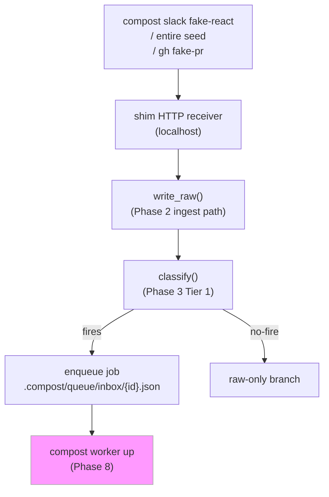
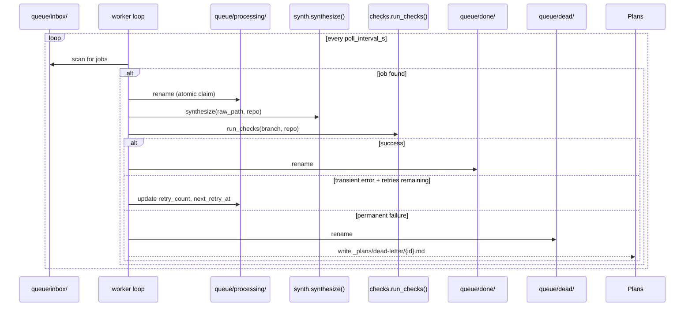

# Phase 7 & 8: Local Shims + Async Worker — High-Level Plan

## Starting Prompt

> @_plans/2026-04-23-2149-laptop-steel-thread-high-level.md lets do Phase 7 & 8 together. Consult @_plans/backlog.md if there is anything releveant.

---

## § Context

Phase 7 adds four local shims so that push-based ingestion sources (Slack reactions, Entire
checkpoints, GitHub PR webhooks) can be exercised on a laptop without touching real external
services. Phase 8 moves synthesis from "run inline during `raw add`" to "run asynchronously
from a durable on-disk queue," turning the laptop into a proper event-driven pipeline.

Relevant backlog item: **"single persistent qmd/compost process"** (backlog §Architecture).
The backlog explicitly flags Phase 8 as the right moment to revisit whether `compost mcp`
should talk to a running `qmd mcp` process rather than shelling out per query. This plan
does NOT implement that change (it is non-trivial and orthogonal to the queue/shim work),
but the worker process is a natural anchor point for a future persistent-qmd experiment.
The plan leaves a `TODO` comment hook in the worker startup path.

---

## § Modules changed

| Module | Change |
|--------|--------|
| `tools/compost/shims/` | **new package** — four shim files + supervisor |
| `tools/compost/worker/` | **new package** — queue model + worker loop |
| `tools/compost/cli.py` | add `shims` and `worker` command groups |
| `tools/compost/bootstrap.py` | create queue dirs, update `.gitignore` |
| `tools/compost/pyproject.toml` | register new packages; add `fastapi`, `uvicorn` as optional `shims` extras |
| `tools/compost/tests/` | new `test_worker.py`, new `test_shims.py` |

No changes to `ingest/`, `synth/`, `checks/`, or `mcp/`. The worker calls the same
`synthesize()` and `run_checks()` functions the CLI already calls; it just drives them
from the queue rather than inline.

---

## § Data flow

### Phase 7: shims feed raw/ and enqueue jobs



### Phase 8: worker drains queue



### `compost raw add` modes

The existing inline-synth path is preserved. A new config flag selects async mode:

```
.compost.yml:
  worker:
    mode: inline   # default — existing Phase 4/5 behavior unchanged
    # mode: async  # enqueue; worker loop handles synth + checks
    poll_interval_s: 5
    max_retries: 3
    retry_backoff_base_s: 30
```

When `mode: async`, `raw add` writes the job and exits immediately; the worker loop
picks it up. `compost synth run` remains available for ad-hoc on-demand synthesis
in both modes.

---

## § Core domain objects

### Queue model (`tools/compost/worker/queue.py`)

```python
import json, os, uuid
from dataclasses import dataclass, asdict
from datetime import datetime, timezone
from pathlib import Path


@dataclass
class Job:
    id: str                    # uuid4 hex
    raw_rel: str               # path relative to repo root
    branch: str                # git branch the raw was committed on
    enqueued_at: str           # ISO 8601
    source: str                # "cli" | "slack_shim" | "entire_shim" | "gh_webhook_shim"
    retry_count: int = 0
    next_retry_at: str | None = None
    last_error: str | None = None


def queue_root(repo: Path) -> Path:
    return repo / ".compost" / "queue"


def enqueue(repo: Path, raw_rel: str, branch: str, source: str = "cli") -> Job:
    """Write a new job to inbox/. Returns the Job."""
    job = Job(
        id=uuid.uuid4().hex,
        raw_rel=raw_rel,
        branch=branch,
        enqueued_at=datetime.now(timezone.utc).isoformat(),
        source=source,
    )
    _inbox(repo).mkdir(parents=True, exist_ok=True)
    _write_job(_inbox(repo) / f"{job.id}.json", job)
    return job


def claim_next(repo: Path) -> Job | None:
    """Atomically move oldest inbox job to processing/. Returns Job or None."""
    jobs = sorted(_inbox(repo).glob("*.json"))
    for path in jobs:
        target = _processing(repo) / path.name
        try:
            os.rename(path, target)  # atomic on POSIX same-filesystem
            return _read_job(target)
        except FileNotFoundError:
            continue  # claimed by another process (future-proofing)
    return None


def complete(repo: Path, job: Job) -> None:
    src = _processing(repo) / f"{job.id}.json"
    _done(repo).mkdir(parents=True, exist_ok=True)
    os.rename(src, _done(repo) / f"{job.id}.json")


def dead_letter(repo: Path, job: Job, error: str) -> None:
    job.last_error = error
    src = _processing(repo) / f"{job.id}.json"
    _dead(repo).mkdir(parents=True, exist_ok=True)
    os.rename(src, _dead(repo) / f"{job.id}.json")
    _write_dead_letter_md(repo, job, error)


def requeue_stuck(repo: Path, older_than_s: int = 300) -> int:
    """On worker startup: move processing/ jobs older than threshold back to inbox/."""
    ...
```

The job file is owned entirely by `queue.py`. No other module formats or parses job JSON
directly; callers use `enqueue()` / `claim_next()` / `complete()` / `dead_letter()`.

### Worker loop (`tools/compost/worker/worker.py`)

```python
@dataclass
class WorkerConfig:
    poll_interval_s: int = 5
    max_retries: int = 3
    retry_backoff_base_s: int = 30   # actual delay = base * 2^retry_count


def run_worker(repo: Path, config: WorkerConfig) -> None:
    """Long-running synthesis + checks loop. Ctrl-C exits cleanly."""
    requeue_stuck(repo)
    # TODO(backlog): explore starting a persistent qmd mcp process here
    #   to eliminate per-query model warmup.
    while True:
        job = claim_next(repo)
        if job is None:
            time.sleep(config.poll_interval_s)
            continue
        _process_job(repo, job, config)
```

### Shim contracts

```python
# tools/compost/shims/slack_shim.py
# FastAPI app on localhost:8421
# POST /events  body: SlackReactionEvent
# Writes raw/slack/..., enqueues job.

@dataclass
class SlackReactionEvent:
    channel: str
    thread_ts: str     # Slack message timestamp (used as origin)
    emoji: str         # only "wiki" triggers ingest
    text: str          # message body
    user: str          # Slack user ID (mapped to git user)


# tools/compost/shims/entire_shim.py
# No HTTP — polls one or more local git repos on a configurable interval.
# Materializes new commits as raw/checkpoints/YYYY/MM/DD/{sha}-{slug}.md

@dataclass
class WatchTarget:
    repo: Path                       # local git repo to watch
    branch_prefix: str = ""          # only commits on branches matching this prefix
    path_filter: str = ""            # only commits touching this path prefix (e.g. "src/payments/")
    # Multiple WatchTargets with the same repo but different path_filter values are supported.
    # The shim tracks "last seen" SHA per target, so each target processes commits independently.
    # A commit touching both watched paths produces two checkpoint files (one per target),
    # each scoped to its path context, each getting its own synthesis job.

@dataclass
class EntireShimConfig:
    targets: list[WatchTarget]       # one or more repos/path-filters to watch
    poll_interval_s: int = 10


# tools/compost/shims/gh_webhook_shim.py
# FastAPI app on localhost:8422
# POST /webhook  body: GitHubPREvent
# On "opened" + label "compost/synth": enqueues a synthesis job.
# repo_full_name mirrors the real GitHub webhook payload (owner/repo-name);
# the shim uses it to locate the matching local checkout via shims.entire.targets.

@dataclass
class GitHubPREvent:
    action: str        # "opened" | "labeled" | "synchronize"
    pr_number: int
    branch: str
    labels: list[str]
    repo_full_name: str   # e.g. "acme/payments" — identifies which local repo this PR came from


# tools/compost/shims/supervisor.py
# Launches slack_shim and gh_webhook_shim as uvicorn subprocesses.
# entire_shim runs as a blocking thread within the supervisor process.
# compost shims up / compost shims down

def start_shims(repo: Path, config: ShimsConfig) -> None: ...
def stop_shims() -> None: ...
```

### Shim config in `.compost.yml`

```yaml
shims:
  slack:
    port: 8421
    wiki_emoji: wiki       # which reaction triggers ingest
  gh_webhook:
    port: 8422
  entire:
    poll_interval_s: 10
    targets:
      - repo: ~/workspace/payments-service
        branch_prefix: ""        # watch all branches
        path_filter: ""          # watch all paths
      - repo: ~/workspace/auth-service
        branch_prefix: "main"
        path_filter: "src/"      # only commits touching src/
```

---

## § CLI additions

```
compost shims up        # start all configured shims in the background
compost shims down      # send SIGTERM to supervised shims
compost shims status    # print per-shim PID and port

compost slack fake-react --channel eng --ts 1234567890.000 --text "..."
                        # POST fake SlackReactionEvent to slack_shim

compost entire seed --repo ~/workspace/foo --sha abc123 [--path src/]
                        # materialize one checkpoint without the watcher

compost gh fake-pr --branch raw/2026-05-05T1234-foo --action opened
                        # POST fake GitHubPREvent to gh_webhook_shim

compost worker up       # blocking; Ctrl-C to stop
compost worker status   # print queue depths (inbox/processing/done/dead)
compost worker retry --job-id <hex>
                        # move a dead-letter job back to inbox
```

---

## § `.compost/` directory additions

```
.compost/
├── queue/
│   ├── inbox/          # new jobs waiting to be claimed
│   ├── processing/     # jobs currently being worked
│   ├── done/           # completed jobs (pruned by worker after N days)
│   └── dead/           # permanently failed jobs
└── shims/
    ├── slack_shim.pid
    └── gh_webhook.pid
```

`bootstrap.py` creates `queue/{inbox,processing,done,dead}/` and `shims/`.
`.gitignore` gets entries for `.compost/queue/` and `.compost/shims/`.

---

## § Tests

**`test_worker.py`** (unit — no LLM calls, no HTTP):
- `enqueue()` writes a file to `inbox/`
- `claim_next()` returns `None` on empty queue
- `claim_next()` atomically moves to `processing/`
- `complete()` moves to `done/`
- `dead_letter()` moves to `dead/` and writes a markdown file under `_plans/dead-letter/`
- `requeue_stuck()` moves old `processing/` jobs back to `inbox/`
- exponential backoff delay calculation is correct for retry N

**`test_shims.py`** (unit — stubs for `write_raw` and `enqueue`):
- `slack_shim` ignores reactions with emoji other than configured `wiki_emoji`
- `slack_shim` calls `write_raw` + `enqueue` on a matching reaction
- `entire_shim` materializes a new commit from a bare local git repo
- `gh_webhook_shim` only triggers on `action=opened` or `labeled` with `compost/synth` label
- supervisor PID files are written and cleaned up on stop

**Updated `conftest.py`**: add `compost_git_repo_with_queue` fixture that layers
`queue/{inbox,processing,done,dead}/` onto the existing `compost_git_repo`.

---

## § Documentation updates

- `tools/compost/README.md` — add `§ Shims` and `§ Worker` sections documenting the
  `compost shims up` / `compost worker up` workflow. Note the config keys.
- `tools/compost/shims/` module docstrings serve as the contract documentation for each
  shim (per the high-level plan's "documented in module docstrings, not a separate doc file"
  convention). No separate README needed in the shims package.

---

## § Cross-check (PHILOSOPHY.md)

| Red Flag | Assessment |
|----------|------------|
| **Information Leakage** | Job JSON format must live exclusively in `queue.py`. Risk: shim code tempted to hand-roll job dicts. Mitigation: `enqueue()` is the only write path; shims call it with typed args, never format JSON directly. |
| **Temporal Decomposition** | Risk: structuring shims around "what happens first" (receive, parse, write, enqueue) rather than clean ownership. Mitigation: each shim owns only HTTP receiving and event parsing. `write_raw` and `enqueue` calls are delegated unchanged to existing modules. |
| **Pass-Through Method** | Supervisor is thin by design — it just `Popen`s uvicorn processes. Acceptable: process management is inherently orchestration, not logic. |
| **Punting Complexity** | Dead-letter: we write a markdown file and stop. The "retry" command lets operators manually re-queue. This is correct for a laptop tool — do not add auto-retry heuristics. |
| **Shallow Module** | `queue.py` is deep: callers get `enqueue/claim/complete/dead_letter` with no knowledge of file layout, atomic rename mechanics, or stuck-job recovery. |

| Cross-Check | Assessment |
|-------------|------------|
| **Correctness** | Atomic `os.rename()` for queue state transitions is POSIX-guaranteed for same-filesystem moves. All queue dirs must be under the same `.compost/` subtree (same filesystem as the repo). `requeue_stuck()` on worker startup handles crash recovery. |
| **Performance** | Poll interval is configurable. Laptop use is single-worker; no locking needed beyond the atomic rename. |
| **Data Integrity** | Jobs in `processing/` survive worker crashes (they are not lost). `requeue_stuck()` on next `worker up` recovers them. Done/dead jobs are retained on disk for audit. |

---

### Feedback Log

**`entire_shim` should support multiple repos and path filters**
> Original comment (verbatim): `^^ a team could definitely own more than one repo, and could also want to watch different file paths in the same repo ^^`
>
> Context: appeared under `EntireShimConfig`, which originally had a single `watch_repo: Path` field.
>
> Incorporated: replaced `watch_repo: Path` with `targets: list[WatchTarget]`. Each `WatchTarget` has `repo`, `branch_prefix`, and `path_filter`. The `.compost.yml` shim config block was updated to show a two-target example. `compost entire seed` got an optional `--path` flag.

---

**Multiple `WatchTarget` entries for the same repo**
> Original comment (verbatim): `^^ if I wanted to watch multiple paths for the same repo will the system support multiple WatchTargets with the same repo, but different paths?`
>
> Context: appeared under `WatchTarget`, asking whether two targets pointing at the same repo with different `path_filter` values is valid.
>
> Incorporated: yes, this is the intended pattern. Added a clarifying comment to `WatchTarget`: the shim tracks "last seen" SHA per target, so each target processes commits independently. A commit touching both watched paths produces two checkpoint files and two synthesis jobs, each scoped to its path context.

---

**`GitHubPREvent` should include the source repo**
> Original comment (verbatim): `^^ does the PR event also include the repo? ^^`
>
> Context: appeared under `GitHubPREvent`, which originally had `action`, `pr_number`, `branch`, `labels` but no repo identifier.
>
> Incorporated: added `repo_full_name: str` (e.g. `"acme/payments"`) to `GitHubPREvent`, matching the real GitHub webhook payload shape. The shim uses this to locate which `WatchTarget` the PR came from, which is important once multiple repos are watched.
