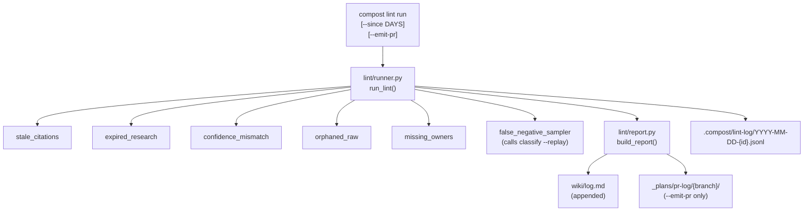

# Phase 9: Lifecycle Lint Pass + Weekly Report

## Starting Prompt

> @_plans/2026-04-23-2149-laptop-steel-thread-high-level.md lets do Phase 9, and consult @_plans/backlog.md for any relevant items

---

## § Context

Phase 9 ships the lifecycle lint job described in the high-level plan §Phase 9 and referenced in `team-context-spec.md §4.8` and `team-context-research-spec.md §6`. Everything prior to this phase is working: raw ingestion, Tier 1 classification, Tier 2 synthesis, Tier 2.5 adversarial checks, research flow, local shims, and the async worker queue.

Phase 9 adds no new synthesis or LLM-heavy work. It is purely deterministic inspection of the accumulated wiki and raw corpus, plus a report that surfaces structural health problems. The only optional LLM call is the false-negative sampler (which delegates to the existing classifier).

**Relevant backlog items:**

- **Winze metabolism phases** (`backlog.md`): "bias audit = structural health checks on the wiki graph (orphan pages, provenance concentration, stale confidence scores)" -- aligns exactly with the linters here. The metabolism framing (a scheduled pass that re-inspects the corpus) is the right mental model for Phase 9.
- No other backlog items directly affect this phase.

---

## § Modules changing

| Module | Change |
|---|---|
| `tools/compost/lint/` | New package: runner, six linter files, report writer |
| `tools/compost/cli/lint.py` | New CLI subcommand group `compost lint` |
| `tools/compost/cli/__init__.py` | Register `lint` group |
| `tools/compost/ingest/classifier.py` | Expose `replay()` function for the false-negative sampler linter |

**New files:**

```
tools/compost/lint/
├── __init__.py
├── runner.py                    # lint runner, JSONL logging, short-circuit
├── report.py                    # markdown report renderer + log.md updater
└── linters/
    ├── __init__.py
    ├── stale_citations.py       # sources point to missing or unreachable raw files
    ├── expired_research.py      # expires_at is in the past (not_promoted OR promoted)
    ├── confidence_mismatch.py   # high-confidence wiki citing low-confidence research
    ├── orphaned_raw.py          # raw files not cited by any wiki page
    ├── missing_owners.py        # wiki pages with empty owners list
    └── false_negative_sampler.py  # replays classifier over recent raws, flags missed fires
tools/compost/cli/lint.py
```

---

## § Data flow



All six linters run independently (no short-circuit between linters: lint is a health survey, not a gate). Each linter is responsible for reading the wiki/raw corpus directly; the runner does not pre-load data.

---

## § Core domain objects

```python
# tools/compost/lint/__init__.py

from __future__ import annotations
from dataclasses import dataclass, field
from typing import Literal


@dataclass(frozen=True)
class LintFinding:
    linter: str
    severity: Literal["error", "warn"]
    message: str
    path: str | None = None          # wiki or raw file path, repo-relative


@dataclass
class LintResult:
    linter: str
    status: Literal["pass", "warn", "error", "skipped"]
    findings: list[LintFinding] = field(default_factory=list)
    duration_s: float = 0.0
    skip_reason: str | None = None
```

```python
# tools/compost/lint/runner.py

def run_lint(
    repo: Repo,
    since_days: int = 90,
) -> list[LintResult]:
    """
    Run all linters in parallel (threads), log JSONL, return results.
    since_days: how far back orphaned-raw and false-negative sampler look.
    """
```

```python
# tools/compost/lint/report.py

def build_report(results: list[LintResult]) -> str:
    """Return a markdown string: summary table + per-linter finding sections."""

def append_to_log_md(repo: Repo, report: str, run_id: str) -> None:
    """Prepend a dated summary block to wiki/log.md."""
```

```python
# tools/compost/lint/linters/stale_citations.py

def run(repo: Repo) -> LintResult:
    """
    For each wiki page, resolve each path in `sources:` frontmatter.
    Flag if the raw file is missing from disk.
    Severity: error (wiki claims a source that no longer exists).
    """
```

```python
# tools/compost/lint/linters/expired_research.py

def run(repo: Repo) -> LintResult:
    """
    Scan raw/research/ for files where expires_at < today.
    Flag both: (a) not_promoted + expired (error), (b) promoted + expired (warn).
    """
```

```python
# tools/compost/lint/linters/confidence_mismatch.py

def run(repo: Repo) -> LintResult:
    """
    For each wiki page with confidence: high, resolve its sources.
    If any source is a research file with confidence: low, flag it (warn).
    """
```

```python
# tools/compost/lint/linters/orphaned_raw.py

def run(repo: Repo, since_days: int = 90) -> LintResult:
    """
    Find raw files newer than since_days not cited in any wiki page's sources.
    Severity: warn (not necessarily a problem; may be pre-synthesis raw).
    """
```

```python
# tools/compost/lint/linters/missing_owners.py

def run(repo: Repo) -> LintResult:
    """
    Scan wiki/ for pages where owners: is absent or empty.
    Severity: error.
    """
```

```python
# tools/compost/lint/linters/false_negative_sampler.py

def run(repo: Repo, since_days: int = 90) -> LintResult:
    """
    Replay the classifier over raw files in the past since_days.
    Flag raw files that (a) were not synthesized, and (b) would fire
    under the current rules. These are likely missed synthesis opportunities.
    Calls classify.replay() directly (not subprocess).
    Severity: warn.
    """
```

---

## § JSONL log format

Log path: `.compost/lint-log/YYYY-MM-DD-{run_id}.jsonl`

Events written sequentially:

```jsonl
{"event": "lint_start", "ts": "ISO8601", "run_id": "...", "since_days": 90}
{"event": "linter_result", "ts": "ISO8601", "linter": "stale_citations", "status": "warn", "findings_count": 3, "duration_s": 0.12}
{"event": "linter_result", "ts": "ISO8601", "linter": "missing_owners", "status": "error", "findings_count": 1, "duration_s": 0.05}
{"event": "lint_complete", "ts": "ISO8601", "run_id": "...", "total_findings": 4, "emit_pr": false}
```

The runner opens the log file once, passes the path to each linter result writer. No linter writes to the log directly: the runner writes after each linter returns.

---

## § CLI surface

```
compost lint run [--since DAYS] [--emit-pr]
compost lint log [--last N]
```

`compost lint run`:
- Runs all linters, prints a rich table to the terminal (one row per linter: status, finding count, duration).
- Always appends a summary block to `wiki/log.md`.
- With `--emit-pr`: creates a `lint/YYYY-MM-DD` branch, commits the `wiki/log.md` update, then opens a proper PR via `compost pr open`. The PR description is the full lint report (summary table + per-linter findings). The PR is the human review surface: the reviewer reads which pages are missing owners, which citations are stale, etc., and takes action before merging. Does NOT auto-merge.
- `--since DAYS` (default 90): window for orphaned-raw and false-negative sampler.

`compost lint log`:
- Reads `.compost/lint-log/` JSONL files, renders the last N runs in a compact table. Default last 10.

**Terminal output example (rich table):**

```
Linter                   Status   Findings   Duration
─────────────────────────────────────────────────────
stale_citations          warn          3       0.12s
expired_research         error         1       0.08s
confidence_mismatch      pass          0       0.09s
orphaned_raw             warn          7       0.21s
missing_owners           pass          0       0.04s
false_negative_sampler   warn          2       1.40s
─────────────────────────────────────────────────────
Total                                 13       1.94s
```

---

## § The false-negative sampler

The sampler calls the existing `classify.replay()` function (not a subprocess). The Phase 3 `compost classify --replay --since 7d` CLI was already built; the sampler imports the underlying function directly.

The sampler needs to know which raws were already synthesized, so it only flags raws that:
1. Were not synthesized (no `run_complete` event for that raw path in `.compost/synth-log/`), AND
2. Would fire under the current rules.

This requires reading `.compost/synth-log/*.jsonl` for `run_complete` events (not `.compost/classifications.jsonl`, which only records classify decisions, not synthesis completion). The runner passes `repo` to all linters; linters derive these paths from `repo.path`.

---

## § wiki/log.md update format

The `append_to_log_md` function prepends (not appends) a dated block so the most recent entry is always at the top:

```markdown
## Lint Run — 2026-05-07

| Linter | Status | Findings |
|---|---|---|
| stale_citations | warn | 3 |
| expired_research | error | 1 |
| confidence_mismatch | pass | 0 |
| orphaned_raw | warn | 7 |
| missing_owners | pass | 0 |
| false_negative_sampler | warn | 2 |

PR: `lint/2026-05-07` opened for review (if --emit-pr was used)

---
```

---

## § Scheduling (documentation only, no install)

The runner module docstring includes:

```python
# tools/compost/lint/runner.py
"""
Lifecycle lint runner.

To run weekly on macOS, add to crontab (crontab -e):
    0 9 * * 1 cd /path/to/wiki && compost lint run --emit-pr >> ~/.compost/lint-cron.log 2>&1

Or use launchd — example plist (save to ~/Library/LaunchAgents/com.compost.lint.plist):
    <?xml version="1.0" encoding="UTF-8"?>
    <!DOCTYPE plist PUBLIC "-//Apple//DTD PLIST 1.0//EN" "http://www.apple.com/DTDs/PropertyList-1.0.dtd">
    <plist version="1.0">
    <dict>
        <key>Label</key>
        <string>com.compost.lint</string>
        <key>ProgramArguments</key>
        <array>
            <string>/path/to/venv/bin/compost</string>
            <string>lint</string>
            <string>run</string>
            <string>--emit-pr</string>
        </array>
        <key>StartCalendarInterval</key>
        <dict>
            <key>Weekday</key>
            <integer>1</integer>
            <key>Hour</key>
            <integer>9</integer>
            <key>Minute</key>
            <integer>0</integer>
        </dict>
        <key>WorkingDirectory</key>
        <string>/path/to/wiki</string>
    </dict>
    </plist>
    Load with: launchctl load ~/Library/LaunchAgents/com.compost.lint.plist
"""
```

---

## § Tests

| Test file | What it covers |
|---|---|
| `tests/lint/test_stale_citations.py` | Raw file missing from disk flags as error; present file passes |
| `tests/lint/test_expired_research.py` | Past `expires_at` with `not_promoted` = error; `promoted` = warn; future = pass |
| `tests/lint/test_confidence_mismatch.py` | High-conf wiki citing low-conf research = warn; same-conf = pass |
| `tests/lint/test_orphaned_raw.py` | Raw not in any sources = warn; within-window only |
| `tests/lint/test_missing_owners.py` | Empty `owners:` = error; absent `owners:` = error; present = pass |
| `tests/lint/test_false_negative_sampler.py` | Mock classify.replay; cross-ref against synth log correctly |
| `tests/lint/test_runner.py` | All linters run; JSONL log written with correct events |
| `tests/lint/test_report.py` | Markdown table renders; log.md prepended correctly |

All tests use `tmp_path` fixtures with minimal synthetic wiki/raw files. No real LLM calls (the false-negative sampler test mocks `classify.replay`).

---

## § Documentation updates

- `wiki/log.md`: updated on every `compost lint run` (content grows over time)
- No README or ARCHITECTURE changes needed; Phase 9 is additive and self-contained

---

## § Dropped / deferred from the high-level plan

None. All Phase 9 deliverables from the high-level plan are included:
- Six linters (stale citations, expired research, confidence mismatch, orphaned raw, missing owners, false-negative sampler)
- `compost lint run [--emit-pr] [--since DAYS]`
- `wiki/log.md` updated on every run
- Scheduling documentation in module docstring (launchd plist + crontab)
- False-negative sampler tied to Phase 3 classifier replay

The high-level plan also mentioned a `compost lint log` view command; that is included here as a simple JSONL reader (consistent with `compost synth log`).

---

## § Cross-check against PHILOSOPHY.md

| Red Flag | Verdict |
|---|---|
| **Information Leakage** | Each linter reads the corpus independently. The runner does not pre-parse frontmatter and hand it to linters -- linters own their own reads. If frontmatter parsing logic is shared, it should go through `model/frontmatter.py` which already exists. No leakage. |
| **Temporal Decomposition** | Module split is by *concern* (each linter is a distinct invariant), not by execution order. The runner can run them in any order or in parallel. |
| **Pass-Through Method** | `run_lint()` does real work: parallel execution, JSONL logging, result aggregation. Not a pass-through. |
| **Punting Complexity** | Linters return `LintResult` with findings rather than raising. The runner never throws on linter failure; a linter that errors internally returns `status="skipped"` with a `skip_reason`. |
| **Shallow Module** | The lint package exposes two public functions (`run_lint`, `build_report`) and a clean set of types. The interface is simpler than the implementation. |
| **Hard to Name** | All names are precise: `LintFinding`, `LintResult`, linter filenames map 1:1 to their invariant. |

| Cross-Check | Verdict |
|---|---|
| **Correctness** | Linters are read-only; they cannot corrupt wiki or raw state. The `--emit-pr` path writes only to `wiki/log.md` (on a branch) and opens a PR via `compost pr open` -- the same PR machinery tested in Phase 2. |
| **Performance** | Six linters run in parallel (threads). The slowest is the false-negative sampler (calls classify replay). On a 90-day window of a small wiki, total wall time should be under 5s. No LLM calls in any linter except via classify replay, which is already bounded. |
| **Data Integrity** | No linter modifies the corpus. `append_to_log_md` prepends to `wiki/log.md`; concurrent runs are not guarded (not needed -- lint is run at most once at a time by the laptop scheduler). |

---

### Post-implementation notes

**`_load_gitea_client` import hoisted to module level in `cli/lint.py`** (post-verify fix)
> The original implementation imported `_load_gitea_client` inside `_emit_lint_pr` (local import inside a try/except), which made it impossible to monkeypatch. After the `/verify` pass identified that `--emit-pr` had no test coverage, the import was moved to module level so `monkeypatch.setattr("compost.cli.lint._load_gitea_client", ...)` works. Test `test_emit_pr_creates_branch_pushes_and_opens_pr` was added using the existing `compost_git_repo_with_remote` fixture and a hand-rolled `FakeClient`.

### Feedback Log

**`--emit-pr` should use the real PR flow, not `_plans/pr-log/`**
> Original comment (verbatim): `^^ we shouldn't be writing to _plans or pr-log anymore, those are stale. what is the goal with a branch the lint-report? should it open a proper PR instead? Is the intent that we want a human to review the reports? ^^`
>
> Context: appeared under the `compost lint run` bullet that described creating `_plans/pr-log/{branch}/lint-report.md`.
>
> Incorporated: `--emit-pr` now creates a `lint/YYYY-MM-DD` branch, commits the `wiki/log.md` update, and opens a proper PR via `compost pr open`. The PR description carries the full lint report. The PR is the human review surface: the reviewer sees which pages are missing owners, which citations are stale, and takes action before merging.
