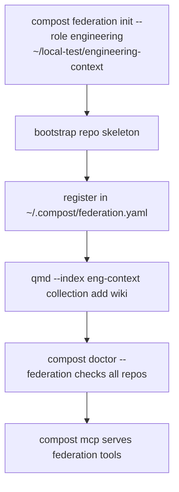
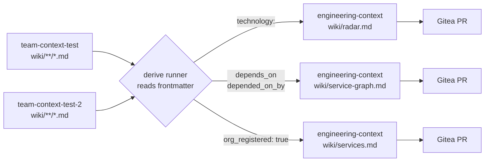

# Phase 10 & 11: Federation + Derived Artifacts, High-Level Plan

## Starting Prompt

> @_plans/2026-04-23-2149-laptop-steel-thread-high-level.md lets work on Phase 10 & 11 together, and pull in anything relevant from the @_plans/backlog.md

---

## § Context

Phases 1-9 produced a single-repo pipeline: raw ingestion, Tier 1 classify, Tier 2 synth, Tier 2.5 checks, local PR workflow via Gitea, shims, async worker, and lifecycle lint. The MCP server is single-repo and single-index.

Phases 10 and 11 close the remaining steel-thread gaps:

- **Phase 10** proves the multi-repo federation model: a second local team repo plus the `engineering-context` skeleton, a global `~/.compost/federation.yaml`, and two new MCP tools that fan out queries across repos at read time.
- **Phase 11** generates the derived artifacts (Radar, service graph, master service index) from wiki frontmatter, writing them back via the Gitea PR flow from Phase 2.

Backlog items pulled in:

- **qmd per-index isolation** (backlog "Verify: qmd --index per-index isolation"): must be verified before bootstrapping a second wiki instance. This becomes Step 1 of Phase 10.
- **Persistent qmd process** (backlog "single persistent qmd/compost process"): the federation router naturally wants a long-lived process. The Phase 10 MCP design will note the swap-in path but does not implement it; the backlog item stays for Phase 12+ as originally deferred.
- **winze metabolism phases** (backlog "winze"): the `dream` / `bias-audit` / `calibrate` split maps onto derive jobs but is out of scope for Phase 11. The `compost derive` commands are the structural prerequisite; metabolism scheduling is deferred.
- **Disputes as first-class predicate** (backlog "winze", item 1): Phase 5 checks already emit structured `Finding` objects. The missing `compost claims suggest` command is noted here as a Phase 10 deliverable since it reads from the same wiki graph that federation will surface.

---

## § High-level plan

### Phase 10: Second local repo, engineering layer, federation

#### New modules and files

| Path | Status | Purpose |
|---|---|---|
| `tools/compost/mcp/federation.py` | new | Federation config loader + multi-repo fan-out logic |
| `tools/compost/mcp/tools.py` | extend | Add `query_across_org`, `find_service_owner` |
| `tools/compost/mcp/server.py` | extend | Register federation tools when config present |
| `tools/compost/model/frontmatter.py` | extend | Add derivation fields to `Frontmatter` TypedDict |
| `~/.compost/federation.yaml` | new (user-global) | Lists repo paths, qmd indexes, and repo roles |
| `~/local-test/engineering-context/` | bootstrap | Engineering repo skeleton |
| `~/local-test/team-context-test-2/` | bootstrap | Second team repo skeleton (Phase 10 federation smoke test) |
| `tools/compost/cli/federation.py` | new | `compost federation` subcommands |
| `tools/compost/tests/test_federation.py` | new | Unit tests for federation fan-out |

#### Federation config schema

```python
# tools/compost/mcp/federation.py

from pathlib import Path
from typing import Literal
from dataclasses import dataclass
import yaml


@dataclass(frozen=True)
class FederatedRepo:
    name: str
    path: Path
    qmd_index: str
    role: Literal["team", "org", "engineering"]


def load_federation_config(config_path: Path | None = None) -> list[FederatedRepo]:
    """Read ~/.compost/federation.yaml; returns [] if file absent."""
    ...


def fan_out_query(
    query: str,
    repos: list[FederatedRepo],
    roles: list[str] | None = None,  # None = all roles
    limit_per_repo: int = 5,
) -> list[dict]:
    """Query each repo's qmd index in parallel threads, deduplicate by entity name."""
    ...
```

`~/.compost/federation.yaml` shape:

```yaml
repos:
  - name: team-context-test
    path: /Users/eoin/local-test/team-context-test
    qmd_index: tc-test
    role: team
  - name: team-context-test-2
    path: /Users/eoin/local-test/team-context-test-2
    qmd_index: tc-test-2
    role: team
  - name: engineering-context
    path: /Users/eoin/local-test/engineering-context
    qmd_index: eng-context
    role: engineering
```

#### New MCP tools

```python
# additions to tools/compost/mcp/tools.py

def query_across_org(query: str, limit: int = 10) -> str:
    """Fan out a query to all configured repos, merge and deduplicate results."""
    ...


def find_service_owner(service: str) -> str:
    """Search for a service in the engineering repo's services.md index.
    Falls back to team repos if not found in engineering."""
    ...
```

The server registers these only when `~/.compost/federation.yaml` exists.

#### Frontmatter additions

```python
# tools/compost/model/frontmatter.py — additions to Frontmatter TypedDict

depends_on: list[str]          # service/module names this page depends on
depended_on_by: list[str]      # inverse: who depends on this page
technology: list[str]          # tech tags, drives derive radar
org_registered: bool           # true once promoted to engineering services index
```

`FrontmatterType` gains no new values; `org_registered` is team-wiki-side metadata that signals the engineering service index should include this entity.

#### Federation bootstrap flow



#### qmd per-index isolation verification (Step 1)

Before bootstrapping a second wiki, verify that `qmd --index tc-test-2 collection add wiki` is invisible to `tc-test`. Implementation: add a test in `tests/test_federation.py` that creates two temp qmd indexes, registers identical collection names in each, indexes different content, and asserts queries on each index only return content from that index.

#### CLI additions

```
compost federation list                  # show all repos in ~/.compost/federation.yaml
compost federation add --name ... \
  --path ... --role ... --qmd-index ...  # append an entry
compost federation doctor                # verify each repo's qmd collections are indexed
```

#### Engineering repo skeleton

```
engineering-context/
├── .compost.yml            # gitea config, qmd_index: eng-context
├── ENGINEERING.md          # team list + service index pointer
├── wiki/
│   └── services.md         # hand-authored master service index (drives find_service_owner)
└── raw/
```

`services.md` format: a simple table with columns `service`, `owner_team`, `repo`, `status`. The `find_service_owner` MCP tool parses this directly (no LLM, deterministic).

#### Steel thread

From Claude Code: ask "who owns the payments service?". MCP calls `find_service_owner("payments")`, reads `engineering-context/wiki/services.md`, returns owner team. Then `query_across_org("payments architecture")` fans out to both team repos, merges results. Demonstrates that federation routing works end-to-end without network hops.

---

### Phase 11: Derived artifacts

#### New modules and files

| Path | Status | Purpose |
|---|---|---|
| `tools/compost/derive/__init__.py` | new | `DeriveResult` dataclass |
| `tools/compost/derive/radar.py` | new | Scan `technology:` frontmatter, emit Radar page |
| `tools/compost/derive/graph.py` | new | Scan `depends_on`/`depended_on_by`, emit Mermaid graph |
| `tools/compost/derive/services.py` | new | Rebuild `engineering-context/wiki/services.md` |
| `tools/compost/cli/derive.py` | new | `compost derive` subgroup |
| `tools/compost/tests/test_derive.py` | new | Unit tests for each derive job |

#### Core domain objects

```python
# tools/compost/derive/__init__.py

from dataclasses import dataclass, field


@dataclass
class DeriveResult:
    job: str                            # "radar" | "graph" | "services"
    output_path: str                    # repo-relative path written
    pages_scanned: int
    entries_written: int
    warnings: list[str] = field(default_factory=list)
```

#### Job: `compost derive radar`

Reads `technology:` field from all `wiki/**/*.md` files across all configured team repos. Groups by technology tag. Writes `engineering-context/wiki/radar.md` as a descriptive Radar page (a Markdown table: Technology | Quadrant | Adopting Teams | Notes). Quadrant is not LLM-assigned; it comes from an optional `radar_quadrant:` field on individual wiki pages, defaulting to "Assess" if absent.

```python
# tools/compost/derive/radar.py

def derive_radar(
    team_repos: list[FederatedRepo],
    eng_repo: Path,
) -> DeriveResult:
    """Scan technology: frontmatter, write radar.md into engineering-context."""
    ...
```

#### Job: `compost derive graph`

Reads `depends_on` and `depended_on_by` from all team wiki pages. Emits a Mermaid flowchart into `engineering-context/wiki/service-graph.md`. If a dependency reference does not resolve to a known wiki page in any federated repo, it is flagged as a warning in `DeriveResult.warnings`.

```python
# tools/compost/derive/graph.py

def derive_graph(
    team_repos: list[FederatedRepo],
    eng_repo: Path,
) -> DeriveResult:
    """Emit a Mermaid service dependency graph from depends_on frontmatter."""
    ...
```

#### Job: `compost derive services`

Rebuilds `engineering-context/wiki/services.md` by scanning `org_registered: true` wiki pages across all team repos. Produces a fresh Markdown table: Service | Owner Team | Status | Repo. This is the only derive job that overwrites content that `find_service_owner` reads; it closes the feedback loop from Phase 10.

```python
# tools/compost/derive/services.py

def derive_services(
    team_repos: list[FederatedRepo],
    eng_repo: Path,
) -> DeriveResult:
    """Rebuild services.md from org_registered frontmatter across team repos."""
    ...
```

#### PR integration

Each derive job calls the Phase 2 `ingest/pr.py` helpers to open a Gitea PR in the engineering repo with the generated diff. Uses `--repo-path ~/local-test/engineering-context` and the `eng-context` Gitea remote.

#### CLI

```
compost derive radar      [--dry-run]   # write radar.md, optionally open PR
compost derive graph      [--dry-run]   # write service-graph.md, optionally open PR
compost derive services   [--dry-run]   # rebuild services.md, optionally open PR
compost derive all        [--dry-run]   # run all three in order
```

#### Data flow



#### Steel thread

Set `org_registered: true` and `depends_on: [payments]` on a service page in `team-context-test`. Run `compost derive all`. Observe three PRs open in the Gitea engineering-context repo: one updating `services.md` with the new service, one updating the Mermaid graph, one updating the Radar with the service's technology tags.

---

## § Tests

| File | Coverage |
|---|---|
| `tests/test_federation.py` | qmd per-index isolation; `fan_out_query` merges results from two indexes; `find_service_owner` parses `services.md`; federation config absent returns empty list without error |
| `tests/test_derive.py` | each derive job with fixture wiki pages; `DeriveResult` fields are correct; unknown `depends_on` refs become warnings not errors; dry-run produces no file writes |
| `tests/test_frontmatter.py` | extend existing tests: new derivation fields validate correctly; optional fields absent is valid |

---

## § Documentation updates

| File | Update needed |
|---|---|
| `ENGINEERING.md` (in `engineering-context/`) | Created in Phase 10 bootstrap; points to `wiki/services.md` and `wiki/radar.md` |
| High-level plan (`2026-04-23-2149-...`) | Phase 10 and 11 are now implemented; no content change needed |
| Backlog (`backlog.md`) | Remove "Verify: qmd --index per-index isolation" after test passes; update "persistent qmd process" to note Phase 10 MCP is the natural swap point; add note that `compost claims suggest` is a Phase 10 deliverable |

---

## § Cross-check against PHILOSOPHY.md Red Flags

| Red Flag | Applies? | Mitigation |
|---|---|---|
| **Information Leakage** | Yes: `federation.py` knows qmd index names; `mcp/server.py` knows federation config exists. Mitigate: `federation.py` owns all config loading and query fan-out. `server.py` calls `load_federation_config()` once at startup; it does not know the format. | Contained |
| **Temporal Decomposition** | Mild: derive jobs are ordered (services before radar before graph in a real workflow), but the runner does not encode that order. `compost derive all` runs all three independently. | Not a concern: jobs are independent; order is cosmetic |
| **Pass-Through Method** | Risk: `query_across_org` in `mcp/tools.py` could become a thin wrapper over `federation.fan_out_query`. Acceptable if `tools.py` adds MCP-specific formatting (result deduplication by entity name, trimming to MCP response shape). | Ensure `tools.py` earns its keep by doing result formatting, not just delegation |
| **Punting Complexity** | `find_service_owner` falls back to team repos when the service is missing from `services.md`. This is a correct behavior, not an error; "define errors out of existence" applies. | Already handled by design |
| **Shallow Module** | `derive/radar.py` might just be a frontmatter scan + Markdown writer. If it is < 30 lines of logic, collapse into a single `derive/jobs.py` rather than three tiny files. | Decide at impl time; plan permits consolidation |

### Correctness
The `derive services` job overwrites `services.md`. If a team repo has `org_registered: true` on a deprecated page, that page will appear in the index. Mitigate: `derive_services` skips pages where `status: deprecated` or `status: archived`.

### Performance
`fan_out_query` fans out to N qmd processes in parallel. On a laptop with 2-3 repos this is fine. If a qmd index is cold, the query blocks for ~1s. The warmup call in `run_server` only warms the local repo's index. Phase 10 should warm all federated indexes at server startup (one warmup call per entry in `federation.yaml`).

### Data Integrity
Derive jobs write into `engineering-context/` via a PR branch. They never directly modify team repo wiki pages. The engineering repo is the only write target for derive output; this preserves the invariant that team wikis are authoritative for their own content.

---

*High-level plan ready for review. Waiting for go-ahead before writing the implementation detail.*
